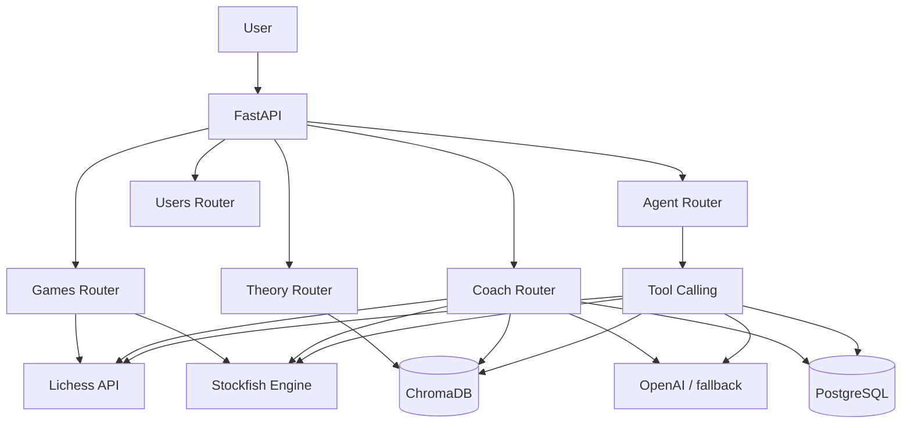

# Cerno

Cerno is an AI-assisted chess coach backend. It retrieves recent Lichess games, analyzes them with Stockfish, identifies recurring weaknesses, retrieves relevant chess theory from a curated ChromaDB knowledge base, and generates a practical training plan. Analyses and user profiles can be persisted in PostgreSQL.

## Stack

- Python and FastAPI
- Lichess API
- `python-chess` and Stockfish
- ChromaDB for semantic retrieval
- OpenAI with a deterministic fallback plan
- PostgreSQL
- SQLAlchemy 2.0 and Alembic
- Docker Compose
- pytest

## Architecture



ChromaDB and PostgreSQL have separate responsibilities:

- ChromaDB stores semantic chess knowledge, embeddings, study chunks, and source metadata.
- PostgreSQL stores users, game analyses, critical moves, weakness profiles, and training recommendations.

## Main Flow

1. The user provides a Lichess username.
2. Cerno retrieves recent games from Lichess.
3. Stockfish evaluates the games and identifies critical moments.
4. The weakness service aggregates errors by game phase.
5. Cerno searches ChromaDB for relevant theory.
6. OpenAI generates a training plan, with a local fallback if no API key is configured.
7. When `save=true`, the analysis is persisted in PostgreSQL.

## Run With Docker

Create a local environment file:

```bash
cp .env.example .env
```

On PowerShell:

```powershell
Copy-Item .env.example .env
```

Build and start the API and PostgreSQL:

```bash
docker compose up --build
```

If the images are already built:

```bash
docker compose up -d
```

Swagger UI is available at:

```text
http://localhost:8000/docs
```

Stop the containers without deleting persisted data:

```bash
docker compose down
```

## Run Locally

The local API expects PostgreSQL at `localhost:5432`.

```powershell
venv\Scripts\activate
docker compose up -d postgres
alembic upgrade head
uvicorn app.main:app --reload
```

The Windows development environment uses `engines/stockfish.exe`. The Docker image installs and uses the Linux Stockfish package.

## Main Endpoints

| Method | Endpoint | Purpose |
| --- | --- | --- |
| `GET` | `/health` | Service healthcheck |
| `GET` | `/games/{username}` | Retrieve recent Lichess games |
| `POST` | `/games/analyze` | Analyze a PGN with Stockfish |
| `POST` | `/theory/search` | Search the ChromaDB knowledge base |
| `POST` | `/coach/analyze-user` | Run the structured coaching flow |
| `POST` | `/agent/chat` | Conversational tool-calling endpoint |
| `GET` | `/users/{username}/analyses` | Retrieve persisted analyses |
| `GET` | `/users/{username}/weakness-profile` | Retrieve the persisted weakness profile |

### Analyze a User

```json
{
  "username": "DrNykterstein",
  "limit": 1,
  "depth": 8,
  "save": true
}
```

For quick local validation, use a lower depth such as `1` or `4`. Higher depths are slower.

## Database Migrations

Apply all migrations:

```bash
alembic upgrade head
```

Inside Docker, the API container applies migrations before starting Uvicorn.

Check the current revision:

```bash
alembic current
```

## RAG Knowledge Base

Index the curated Lichess studies:

```bash
python scripts/index_studies.py
```

Run the manual semantic retrieval checks:

```bash
python scripts/test_rag_queries.py
```

ChromaDB data is persisted in `data/chromadb`.

## Tests

Run the unit test suite:

```bash
pytest
```

The tests mock external boundaries and do not require:

- an OpenAI API key
- internet access
- a real Stockfish process
- real ChromaDB content
- a running PostgreSQL instance

## Environment Variables

| Variable | Description | Default |
| --- | --- | --- |
| `OPENAI_API_KEY` | Optional OpenAI API key | Empty |
| `OPENAI_MODEL` | Model used for training-plan generation | `gpt-4o-mini` |
| `DATABASE_URL` | SQLAlchemy PostgreSQL connection URL | Local `cerno` database |
| `CHROMA_PATH` | ChromaDB persistence directory | `data/chromadb` |
| `STOCKFISH_PATH` | Stockfish executable path | Windows project binary locally |
| `FRONTEND_ORIGIN` | Primary future frontend origin | `http://localhost:3000` |
| `BACKEND_CORS_ORIGINS` | Comma-separated allowed CORS origins | Local port 3000 origins |

## What This Project Demonstrates

- A structured FastAPI backend
- Integration with an external API
- Chess-engine analysis
- Retrieval-augmented generation
- LLM tool calling
- Vector database usage
- Relational persistence and migrations
- Dockerized development
- Test isolation through mocks
- Applied AI architecture with traceable sources

## Current Limitations

- The frontend is not implemented yet.
- Railway and production deployment are pending.
- Stockfish analysis is a useful coaching approximation, not an elite professional preparation tool.
- The initial RAG knowledge base is intentionally small and curated.
- The conversational agent is less structured than the main coach endpoint.

## Roadmap

- Build the frontend experience.
- Deploy the application to Railway.
- Add richer visual weakness profiles and game timelines.
- Expand and evaluate the curated RAG sources.
- Improve chess-specific evaluation and training recommendations.
