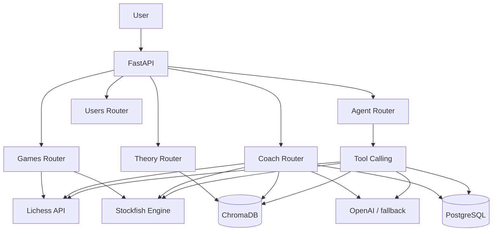

# Cerno

Cerno is an AI-assisted chess coach for Lichess players. It retrieves recent games, analyzes them with Stockfish, identifies recurring weaknesses, retrieves relevant chess theory from a curated ChromaDB knowledge base, and generates a practical training plan. Analyses and user profiles can be persisted in PostgreSQL and reviewed from the Next.js frontend.

## Stack

- Python and FastAPI
- Lichess API
- `python-chess` and Stockfish
- ChromaDB for semantic retrieval
- OpenAI with a deterministic fallback plan
- PostgreSQL
- SQLAlchemy 2.0 and Alembic
- Docker Compose
- Next.js
- TypeScript
- Tailwind CSS
- lucide-react
- pytest

## Live Demo

Coming soon.

## Architecture



ChromaDB and PostgreSQL have separate responsibilities:

- ChromaDB stores semantic chess knowledge, embeddings, study chunks, and source metadata.
- PostgreSQL stores users, game analyses, critical moves, weakness profiles, and training recommendations.

## Main Flow

1. The user provides a Lichess username.
2. Cerno retrieves recent games from Lichess.
3. Stockfish evaluates the games and identifies critical moments.
4. The weakness service aggregates errors by game phase.
5. Cerno searches ChromaDB for relevant theory.
6. OpenAI generates a short coach advice paragraph and a training plan, with a local fallback if no API key is configured.
7. When `save=true`, the analysis is persisted in PostgreSQL.

## Running Locally With Docker

Create a local environment file:

```bash
cp .env.example .env
```

On PowerShell:

```powershell
Copy-Item .env.example .env
```

Build and start the full stack:

```bash
docker compose up --build
```

If the images are already built:

```bash
docker compose up -d
```

Application URLs:

```text
Frontend: http://localhost:3000
Backend API docs: http://localhost:8000/docs
Healthcheck: http://localhost:8000/health
```

Stop the containers without deleting persisted data:

```bash
docker compose down
```

## Deployment

The intended deployment setup is:

- Frontend: Railway service
- Backend API: Railway service
- PostgreSQL: Railway PostgreSQL
- ChromaDB: Railway persistent volume mounted on the API service

See [docs/deployment.md](docs/deployment.md) for the full deployment guide.

## Production Limits

The backend applies simple production limits even if a client sends larger values:

- `MAX_GAMES_PER_ANALYSIS`: maximum Lichess games analyzed per coach request.
- `MAX_STOCKFISH_DEPTH`: maximum Stockfish depth used for analysis.

Recommended production values:

```env
MAX_GAMES_PER_ANALYSIS=3
MAX_STOCKFISH_DEPTH=10
```

## Run Locally

The local API expects PostgreSQL at `localhost:5432`.

```powershell
venv\Scripts\activate
docker compose up -d postgres
alembic upgrade head
uvicorn app.main:app --reload
```

The Windows development environment uses `engines/stockfish.exe`. The Docker image installs and uses the Linux Stockfish package.

## Running Frontend Separately

Run the backend with Docker, then start the frontend development server:

```bash
docker compose up -d api postgres
cd frontend
npm install
npm run dev
```

The frontend expects:

```env
NEXT_PUBLIC_API_BASE_URL=http://localhost:8000
```

Open:

```text
http://localhost:3000
```

## Frontend Stack

- Next.js
- TypeScript
- Tailwind CSS
- lucide-react

## Demo Flow

1. Open `http://localhost:3000`.
2. Enter a Lichess username.
3. Analyze recent games.
4. Review the coach advice, phase accuracy, critical moments, training plan, and recommended theory.
5. Open the player profile to inspect saved analysis history.
6. Optionally paste a PGN manually for direct Stockfish analysis.

## Coach Output

The Lichess analysis screen is ordered for a non-technical user:

1. `Coach advice`: a short paragraph that interprets the games in plain language, mentioning the player's main habits, critical mistakes, relative strengths, and next focus.
2. `Phase accuracy`: opening, middlegame, and endgame loss metrics shown in pawn units.
3. `Critical moments`: the most important mistakes or blunders, with their estimated pawn loss.
4. `Training plan`: five practical actions for the next week.
5. `Recommended theory`: relevant study material retrieved from ChromaDB.

The training plan intentionally avoids raw study IDs such as `efGLGZOM`. Theory links and study metadata belong in the `Recommended theory` section, while the plan should stay readable and action-oriented.

## Understanding The Analysis Metrics

Cerno compares each played move with the move preferred by Stockfish. The app does not treat the score as points that start at 1000 or decrease during the game. Instead, it measures the estimated value lost by a move.

Stockfish evaluates positions in pawn units, similar to the engine evaluation bar shown in chess analysis boards. For example, if the best move keeps the position at `+1.20` but the played move leaves it at `+0.70`, the move lost about `0.50` pawns of value.

Internally, chess engines often use centipawns:

```text
1 pawn = 100 centipawns
50 centipawns = 0.50 pawns
320 centipawns = 3.20 pawns
```

The frontend shows this in friendlier language:

| UI label | Meaning | How to read it |
| --- | --- | --- |
| `Avg. loss` | Average value lost per move in that phase | Lower is better. `~0.20` is much cleaner than `~1.20`. |
| `Pawn loss` | Value lost by one critical move | `Pawn loss: ~3.2` means the move worsened the position by roughly 3.2 pawns compared with Stockfish's best move. |
| `Inaccuracy` | Small but relevant loss | Usually a move that gives up some quality but does not ruin the game. |
| `Mistake` | Serious loss | A move that changes the evaluation significantly. |
| `Blunder` | Very large loss | A move that can decide the game or throw away a major advantage. |

Example:

```text
Opening Avg. loss: ~0.24
Middlegame Avg. loss: ~0.83
Endgame Avg. loss: ~0.41
```

This means the opening was comparatively accurate, the middlegame was the weakest phase, and the endgame was better than the middlegame but still had room for improvement.

## Screenshots

> Add screenshots of the home page, analysis result, and player profile here.

Suggested files:

- `docs/screenshots/home.png`
- `docs/screenshots/analysis-result.png`
- `docs/screenshots/player-profile.png`

## Main Endpoints

| Method | Endpoint | Purpose |
| --- | --- | --- |
| `GET` | `/health` | Service healthcheck |
| `GET` | `/games/{username}` | Retrieve recent Lichess games |
| `POST` | `/games/analyze` | Analyze a PGN with Stockfish |
| `POST` | `/theory/search` | Search the ChromaDB knowledge base |
| `POST` | `/coach/analyze-user` | Run the structured coaching flow |
| `POST` | `/agent/chat` | Conversational tool-calling endpoint |
| `GET` | `/users/{username}/analyses` | Retrieve persisted analyses |
| `GET` | `/users/{username}/weakness-profile` | Retrieve the persisted weakness profile |

### Analyze a User

```json
{
  "username": "Mikhail_Tal",
  "limit": 1,
  "depth": 8,
  "save": true
}
```

For quick local validation, use a lower depth such as `1` or `4`. Higher depths are slower.

## Database Migrations

Apply all migrations:

```bash
alembic upgrade head
```

Inside Docker, the API container applies migrations before starting Uvicorn.

Check the current revision:

```bash
alembic current
```

## RAG Knowledge Base

Index the curated Lichess studies:

```bash
python scripts/index_studies.py
```

Run the manual semantic retrieval checks:

```bash
python scripts/test_rag_queries.py
```

ChromaDB data is persisted in `data/chromadb`.

## Tests

Run the unit test suite:

```bash
pytest
```

The tests mock external boundaries and do not require:

- an OpenAI API key
- internet access
- a real Stockfish process
- real ChromaDB content
- a running PostgreSQL instance

## Environment Variables

| Variable | Description | Default |
| --- | --- | --- |
| `OPENAI_API_KEY` | Optional OpenAI API key | Empty |
| `OPENAI_MODEL` | Model used for training-plan generation | `gpt-4o-mini` |
| `DATABASE_URL` | SQLAlchemy PostgreSQL connection URL | Local `cerno` database |
| `CHROMA_PATH` | ChromaDB persistence directory | `data/chromadb` |
| `STOCKFISH_PATH` | Stockfish executable path | Windows project binary locally |
| `MAX_GAMES_PER_ANALYSIS` | Maximum Lichess games analyzed per request | `3` |
| `MAX_STOCKFISH_DEPTH` | Maximum Stockfish depth accepted by the backend | `10` |
| `FRONTEND_ORIGIN` | Primary future frontend origin | `http://localhost:3000` |
| `BACKEND_CORS_ORIGINS` | Comma-separated allowed CORS origins | Local port 3000 origins |
| `NEXT_PUBLIC_API_BASE_URL` | API URL baked into the Next.js frontend | `http://localhost:8000` |

## What This Project Demonstrates

- A structured FastAPI backend
- Integration with an external API
- Chess-engine analysis
- Retrieval-augmented generation
- LLM tool calling
- Vector database usage
- Relational persistence and migrations
- Dockerized development
- Full-stack Docker Compose setup
- Next.js frontend
- TypeScript UI implementation
- Test isolation through mocks
- Applied AI architecture with traceable sources

## Current Limitations

- Railway and production deployment are pending.
- Stockfish analysis is a useful coaching approximation, not an elite professional preparation tool.
- The initial RAG knowledge base is intentionally small and curated.
- The conversational agent is less structured than the main coach endpoint.

## Roadmap

- Deploy the application to Railway.
- Add richer visual weakness profiles and game timelines.
- Expand and evaluate the curated RAG sources.
- Improve chess-specific evaluation and training recommendations.
