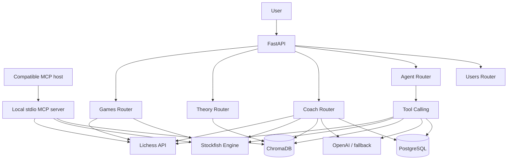
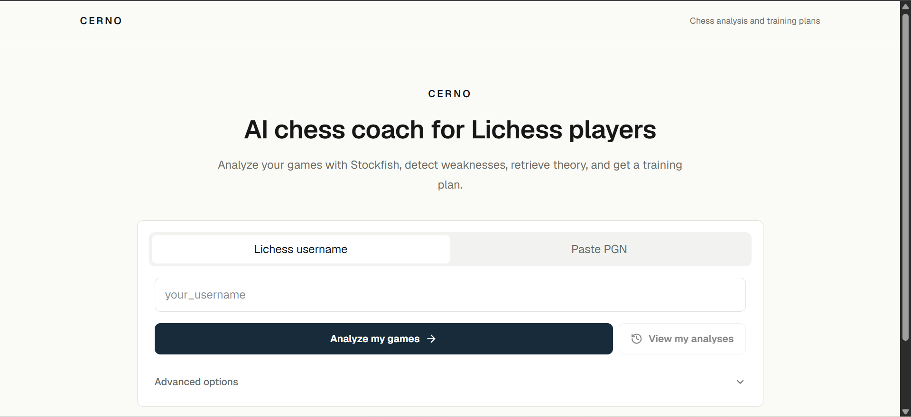
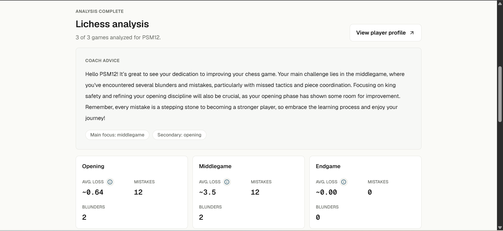

# Cerno

Cerno is an AI-assisted chess coach for Lichess players. It retrieves recent games, analyzes them with Stockfish, identifies recurring weaknesses, retrieves relevant chess theory from a curated ChromaDB knowledge base, and generates a practical training plan. Analyses and user profiles can be persisted in PostgreSQL and reviewed from the Next.js frontend.

## Highlights

- Full-stack AI application deployed on Railway.
- FastAPI backend with Next.js + TypeScript frontend.
- Stockfish-powered chess analysis with critical move detection.
- RAG knowledge base with 21 curated Lichess studies and 523 indexed chunks
  across openings, middlegames, pawn structures, king safety, and endgames.
- Protocol-compliant local MCP server with three typed, read-only tools over
  `stdio`.
- PostgreSQL persistence for users, analyses, critical moves and weakness profiles.
- Docker Compose setup for local development.
- Unit tests with mocked external boundaries: OpenAI, Lichess, Stockfish, ChromaDB and PostgreSQL.

## Stack

- Python and FastAPI
- Lichess API
- `python-chess` and Stockfish
- ChromaDB for semantic retrieval
- Official Python MCP SDK
- OpenAI with a deterministic fallback plan
- PostgreSQL
- SQLAlchemy 2.0 and Alembic
- Docker Compose
- Next.js
- TypeScript
- Tailwind CSS
- lucide-react
- pytest

## Live Demo

- Frontend: https://angelic-liberation-production-e882.up.railway.app
- Backend API docs: https://cerno-production.up.railway.app/docs
- Healthcheck: https://cerno-production.up.railway.app/health

The public deployment runs on Railway with separate frontend, backend, PostgreSQL, and persistent ChromaDB storage.

## Architecture


```mermaid
flowchart TD
    U[User] --> API[FastAPI]
    H[Compatible MCP host] --> MCP[Local stdio MCP server]

    API --> Games[Games Router]
    API --> Theory[Theory Router]
    API --> Coach[Coach Router]
    API --> Agent[Agent Router]
    API --> Users[Users Router]

    Games --> Lichess[Lichess API]
    Games --> Stockfish[Stockfish Engine]

    Theory --> Chroma[(ChromaDB)]

    Coach --> Lichess
    Coach --> Stockfish
    Coach --> Chroma
    Coach --> LLM[OpenAI / fallback]
    Coach --> PG[(PostgreSQL)]

    MCP --> Lichess
    MCP --> Stockfish
    MCP --> Chroma

    Agent --> Tools[Tool Calling]
    Tools --> Lichess
    Tools --> Stockfish
    Tools --> Chroma
    Tools --> LLM
    Tools --> PG
```

ChromaDB and PostgreSQL have separate responsibilities:

- ChromaDB stores semantic chess knowledge, embeddings, study chunks, and source metadata.
- PostgreSQL stores users, game analyses, critical moves, weakness profiles, and training recommendations.

## Main Flow

1. The user provides a Lichess username.
2. Cerno retrieves recent games from Lichess.
3. Stockfish evaluates the games and identifies critical moments.
4. The weakness service aggregates errors by game phase.
5. Cerno searches ChromaDB for relevant theory.
6. The structured coach produces a typed summary, strengths, weaknesses, and
   actionable recommendations. Theory advice cites only retrieved source IDs;
   a deterministic local fallback is used when generation is unavailable.
7. When `save=true`, the analysis is persisted in PostgreSQL.

## Running Locally With Docker

Create a local environment file:

```bash
cp .env.example .env
```

On PowerShell:

```powershell
Copy-Item .env.example .env
```

Build and start the full stack:

```bash
docker compose up --build
```

If the images are already built:

```bash
docker compose up -d
```

`docker compose restart` and `docker compose up -d` reuse the existing images;
they do not copy repository changes into the containers. After changing backend
or frontend code, rebuild both application images explicitly:

```bash
docker compose up -d --build api frontend
```

Application URLs:

```text
Frontend: http://localhost:3000
Backend API docs: http://localhost:8000/docs
Healthcheck: http://localhost:8000/health
```

Stop the containers without deleting persisted data:

```bash
docker compose down
```

## Deployment

The production deployment setup is:

- Frontend: Railway service
- Backend API: Railway service
- PostgreSQL: Railway PostgreSQL
- ChromaDB: Railway persistent volume mounted on the API service

See [docs/deployment.md](docs/deployment.md) for the full deployment guide.

## Production Limits

The backend applies simple production limits even if a client sends larger values:

- `MAX_GAMES_PER_ANALYSIS`: maximum Lichess games analyzed per coach request.
- `MAX_STOCKFISH_DEPTH`: maximum Stockfish depth used for analysis.

Recommended production values:

```env
MAX_GAMES_PER_ANALYSIS=3
MAX_STOCKFISH_DEPTH=10
```

## Run Locally

The local API expects PostgreSQL at `localhost:5432`.

```powershell
venv\Scripts\activate
docker compose up -d postgres
alembic upgrade head
uvicorn app.main:app --reload
```

The Windows development environment uses `engines/stockfish.exe`. The Docker image installs and uses the Linux Stockfish package.

## Local MCP Server

Cerno exposes exactly three local, read-only MCP tools:

- `analyze_pgn`
- `analyze_lichess_player`
- `search_chess_theory`

They reuse the application services, never persist results, never call OpenAI,
and cannot modify the RAG index. Start the server from the repository root:

```powershell
venv\Scripts\python.exe -m app.mcp_server
```

The process uses MCP protocol messages on standard input/output, so an idle
terminal is expected when it is started directly. See
[docs/mcp-local-server.md](docs/mcp-local-server.md) for the Codex client
configuration, tool schemas, examples, limits, and local validation procedure.

## Running Frontend Separately

Run the backend with Docker, then start the frontend development server:

```bash
docker compose up -d api postgres
cd frontend
npm install
npm run dev
```

The frontend expects:

```env
NEXT_PUBLIC_API_BASE_URL=http://localhost:8000
```

Open:

```text
http://localhost:3000
```

## Frontend Stack

- Next.js
- TypeScript
- Tailwind CSS
- lucide-react

## Demo Flow

1. Open `http://localhost:3000`.
2. Enter a Lichess username.
3. Analyze recent games.
4. Review the coach reading, actionable recommendations, phase performance,
   critical moments, training plan, and attributed sources.
5. Open the player profile to inspect saved analysis history.
6. Optionally paste a PGN manually for direct Stockfish analysis.

## Coach Output

The Lichess analysis screen is ordered for a non-technical user:

1. `Coach advice`: a short paragraph that interprets the games in plain language, mentioning the player's main habits, critical mistakes, relative strengths, and next focus.
2. `Phase accuracy`: opening, middlegame, and endgame loss metrics shown in pawn units.
3. `Critical moments`: the most important mistakes or blunders, with their estimated pawn loss.
4. `Training plan`: five practical actions for the next week.
5. `Actionable coaching`: engine-backed and, when evidence exists, cited
   theory-backed recommendations.
6. `Sources`: retrieved material with title/chapter, author, license, and links
   when available.

If retrieval reports `insufficient_evidence`, the report remains useful from
Stockfish and the player profile but contains no theory claim or citation.

## Understanding The Analysis Metrics

Cerno compares each played move with the move preferred by Stockfish. The app does not treat the score as points that start at 1000 or decrease during the game. Instead, it measures the estimated value lost by a move.

Stockfish evaluates positions in pawn units, similar to the engine evaluation bar shown in chess analysis boards. For example, if the best move keeps the position at `+1.20` but the played move leaves it at `+0.70`, the move lost about `0.50` pawns of value.

Internally, chess engines often use centipawns:

```text
1 pawn = 100 centipawns
50 centipawns = 0.50 pawns
320 centipawns = 3.20 pawns
```

The frontend shows this in friendlier language:

| UI label | Meaning | How to read it |
| --- | --- | --- |
| `Avg. loss` | Average value lost per move in that phase | Lower is better. `~0.20` is much cleaner than `~1.20`. |
| `Pawn loss` | Value lost by one critical move | `Pawn loss: ~3.2` means the move worsened the position by roughly 3.2 pawns compared with Stockfish's best move. |
| `Inaccuracy` | Small but relevant loss | Usually a move that gives up some quality but does not ruin the game. |
| `Mistake` | Serious loss | A move that changes the evaluation significantly. |
| `Blunder` | Very large loss | A move that can decide the game or throw away a major advantage. |

Example:

```text
Opening Avg. loss: ~0.24
Middlegame Avg. loss: ~0.83
Endgame Avg. loss: ~0.41
```

This means the opening was comparatively accurate, the middlegame was the weakest phase, and the endgame was better than the middlegame but still had room for improvement.

## Screenshots

### Home


### Analysis result


### Critical moments


### Training plan


## Main Endpoints

| Method | Endpoint | Purpose |
| --- | --- | --- |
| `GET` | `/health` | Service healthcheck |
| `GET` | `/games/{username}` | Retrieve recent Lichess games |
| `POST` | `/games/analyze` | Analyze a PGN with Stockfish |
| `POST` | `/theory/search` | Search the ChromaDB knowledge base |
| `POST` | `/coach/analyze-user` | Run the structured coaching flow |
| `POST` | `/coach/analyze-pgn` | Run the same coach flow for an uploaded PGN and selected player color |
| `POST` | `/agent/chat` | Disabled-by-default experimental tool-calling endpoint |
| `GET` | `/users/{username}/analyses` | Retrieve persisted analyses |
| `GET` | `/users/{username}/weakness-profile` | Retrieve the persisted weakness profile |

### Analyze a User

```json
{
  "username": "Mikhail_Tal",
  "limit": 1,
  "depth": 8,
  "save": true
}
```

For quick local validation, use a lower depth such as `1` or `4`. Higher depths are slower.

## Database Migrations

Apply all migrations:

```bash
alembic upgrade head
```

Inside Docker, the API container applies migrations before starting Uvicorn.

Check the current revision:

```bash
alembic current
```

## RAG Knowledge Base

Index the curated Lichess studies:

```bash
python scripts/index_studies.py
```

Index or refresh the deployed Railway ChromaDB volume through the production API:

```bash
python scripts/index_studies_remote.py --api-base-url https://cerno-production.up.railway.app
```

Run the manual semantic retrieval checks:

```bash
python scripts/test_rag_queries.py
```

ChromaDB data is persisted in `data/chromadb`.

## Tests

Run the unit test suite:

```bash
pytest
```

The tests mock external boundaries and do not require:

- an OpenAI API key
- internet access
- a real Stockfish process
- real ChromaDB content
- a running PostgreSQL instance

## Environment Variables

| Variable | Description | Default |
| --- | --- | --- |
| `OPENAI_API_KEY` | Optional for the structured coach because it has a fallback. Required when the experimental agent is enabled. | Empty |
| `ENABLE_EXPERIMENTAL_AGENT` | Explicitly enables `/agent/chat`; keep disabled for public deployments. | `false` |
| `OPENAI_MODEL` | Model used for training-plan generation | `gpt-4o-mini` |
| `DATABASE_URL` | PostgreSQL connection URL. Railway can provide `${{Postgres.DATABASE_URL}}`; `postgresql://` is normalized for SQLAlchemy. | Local `cerno` database |
| `CHROMA_PATH` | ChromaDB persistence directory | `data/chromadb` |
| `STOCKFISH_PATH` | Stockfish executable path | Windows project binary locally |
| `MAX_GAMES_PER_ANALYSIS` | Maximum Lichess games analyzed per request | `3` |
| `MAX_STOCKFISH_DEPTH` | Maximum Stockfish depth accepted by the backend | `10` |
| `FRONTEND_ORIGIN` | Primary frontend origin | `http://localhost:3000` |
| `BACKEND_CORS_ORIGINS` | Comma-separated allowed CORS origins | Local port 3000 origins |
| `NEXT_PUBLIC_API_BASE_URL` | API URL baked into the Next.js frontend | `http://localhost:8000` |

## What This Project Demonstrates

- A structured FastAPI backend
- Integration with an external API
- Chess-engine analysis
- Retrieval-augmented generation
- LLM tool calling
- MCP tool discovery and typed local `stdio` integration
- Vector database usage
- Relational persistence and migrations
- Dockerized development
- Full-stack Docker Compose setup
- Next.js frontend
- TypeScript UI implementation
- Test isolation through mocks
- Applied AI architecture with traceable sources

## Current Limitations

- Stockfish analysis is a useful coaching approximation, not an elite professional preparation tool.
- The initial RAG knowledge base is intentionally small and curated; a new production volume may need manual study indexing before theory recommendations become rich.
- Retrieval and the production structured coach currently support English
  only.
- The conversational agent is less structured than the main coach endpoint.
- MCP is local-only: there is no remote transport, authentication, shared job
  queue, or concurrency control in this phase.

## Roadmap

- Add richer visual weakness profiles and game timelines.
- Expand and evaluate the curated RAG sources.
- Improve chess-specific evaluation and training recommendations.
