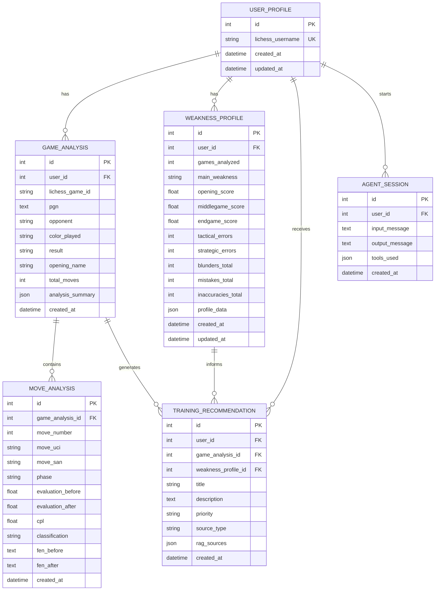
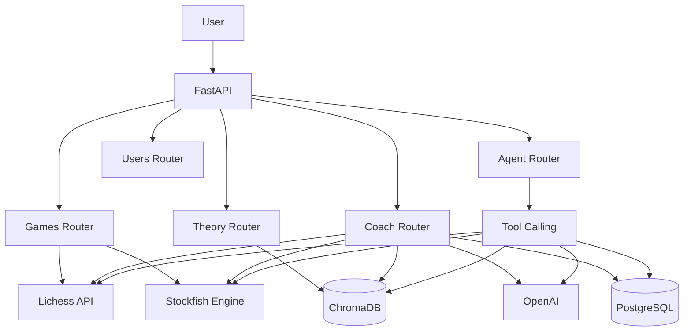

# Plan de continuación del proyecto Cerno

## 0. Contexto actual

Cerno ya es un backend FastAPI funcional en fase prototipo avanzada.

El proyecto ya dispone de:

* Estructura base de aplicación FastAPI.
* Routers existentes para partidas y agente.
* Schemas Pydantic básicos.
* Servicio de Lichess para obtener partidas.
* Servicio de Stockfish con `python-chess`.
* Servicio RAG con ChromaDB persistente.
* Servicio de agente con OpenAI tool calling.
* Endpoint de healthcheck.
* Endpoint para obtener partidas de Lichess.
* Endpoint para analizar PGNs.
* Endpoint de chat del agente.
* Endpoint para indexar estudios de Lichess.
* Scripts recientes para ampliar la base RAG con varios estudios.
* Script de validación de queries RAG o equivalente.
* ChromaDB ya probado con algunos estudios, aunque algunos IDs de Lichess pueden fallar por inexistentes, privados o formato inválido.

Por tanto, el objetivo NO es rehacer el proyecto desde cero.

El objetivo ahora es continuar el desarrollo desde el estado actual, consolidar lo ya construido y evolucionarlo hacia un proyecto de portfolio sólido.

---

# 1. Objetivo general a partir de ahora

Convertir Cerno de prototipo funcional a backend de portfolio serio.

El proyecto debe demostrar:

* FastAPI profesional.
* Integración con API externa de Lichess.
* Análisis de partidas con Stockfish.
* RAG con ChromaDB.
* LLM tool calling.
* PostgreSQL para persistencia.
* Endpoints estructurados y conversacionales.
* Testing básico.
* Dockerización.
* README/demo defendible en entrevista.

El MVP backend antes del frontend debe permitir:

```text
1. Indexar teoría de ajedrez en ChromaDB.
2. Buscar teoría de forma semántica.
3. Obtener partidas recientes de Lichess.
4. Analizar partidas con Stockfish.
5. Detectar debilidades por fase.
6. Recuperar teoría relevante según esas debilidades.
7. Generar un plan de entrenamiento con LLM.
8. Guardar historial, análisis y recomendaciones en PostgreSQL.
9. Consultar el perfil de debilidades del usuario.
```

---

# 2. Principio de trabajo para Codex

No reescribir la aplicación entera.

Antes de modificar cualquier bloque:

```text
1. Inspeccionar el estado actual del código.
2. Identificar qué ya existe.
3. Reutilizar lo que esté bien.
4. Refactorizar solo donde aporte claridad o robustez.
5. Mantener compatibilidad con endpoints existentes.
6. Implementar por bloques cerrados.
7. Ejecutar pruebas o comandos de validación al terminar cada bloque.
```

Evitar:

```text
- Rewrites masivos.
- Cambiar nombres de rutas sin necesidad.
- Romper scripts existentes.
- Rehacer el RAG desde cero.
- Rehacer la estructura actual si ya funciona.
- Introducir frontend todavía.
- Meter autenticación, OAuth o microservicios.
```

---

# 3. Estado actual que se debe preservar

La aplicación ya tiene una estructura parecida a:

```text
app/
  main.py
  routers/
    games.py
    agent.py
  schemas/
    game.py
  services/
    lichess.py
    stockfish.py
    rag.py
    agent.py

scripts/
  index_studies.py
  test_rag_queries.py
```

Puede haber más archivos creados recientemente. Codex debe inspeccionarlos antes de actuar.

Endpoints ya existentes o esperados:

```http
GET /health
GET /games/{username}
POST /games/analyze
POST /agent/chat
POST /agent/index-study
POST /agent/search-theory o POST /theory/search
```

No eliminar ni romper estos endpoints sin justificarlo.

Si se decide mover `/agent/search-theory` a `/theory/search`, mantener compatibilidad o documentar claramente el cambio.

---

# 4. Decisión arquitectónica principal

Cerno tendrá dos tipos de almacenamiento:

## ChromaDB

Uso:

```text
- Teoría de ajedrez.
- Estudios de Lichess.
- Chunks.
- Embeddings.
- Metadatos para RAG.
```

No guardar aquí datos del usuario.

## PostgreSQL

Uso:

```text
- Usuarios analizados.
- Historial de análisis.
- Partidas analizadas.
- Movimientos críticos.
- Perfil de debilidades.
- Recomendaciones generadas.
- Sesiones del agente.
```

No guardar embeddings aquí.

Esta separación debe mantenerse:

```text
ChromaDB = conocimiento semántico.
PostgreSQL = datos de producto e historial.
```

---

# 5. Orden real de continuación

El orden recomendado desde el estado actual es:

```text
Bloque 1 — Cerrar y validar RAG actual
Bloque 2 — Robustecer análisis Stockfish
Bloque 3 — Crear capa de agregación de debilidades
Bloque 4 — Crear endpoint estructurado /coach/analyze-user
Bloque 5 — Añadir PostgreSQL y modelo de datos
Bloque 6 — Conectar persistencia al flujo del coach
Bloque 7 — Mejorar /agent/chat con tool calling robusto
Bloque 8 — Tests
Bloque 9 — Docker + README + demo
```

No empezar por frontend.

No empezar por PostgreSQL antes de tener claro qué datos finales produce el análisis.

---

# 6. Bloque 1 — Cerrar y validar RAG actual

## Objetivo

Dejar el RAG suficientemente fiable antes de conectarlo con el análisis del usuario.

## Estado actual

Ya se han creado scripts para indexar varios estudios de Lichess en ChromaDB.

Algunos estudios pueden fallar. Eso es aceptable.

## Tareas

### 6.1. Revisar scripts existentes

Revisar:

```text
scripts/index_studies.py
scripts/test_rag_queries.py
```

Comprobar que:

```text
- El script indexa estudios uno por uno.
- Usa upsert o equivalente idempotente.
- Continúa aunque un estudio falle.
- Muestra resumen final.
- Informa de estudios fallidos.
- No rompe si ChromaDB ya tiene datos.
```

### 6.2. Validar metadatos

Cada chunk debería tener, como mínimo:

```python
{
    "study_id": "...",
    "chapter": "...",
    "category": "...",
    "source": "https://lichess.org/study/...",
    "type": "lichess_study"
}
```

Si algún campo no puede obtenerse, usar valor razonable:

```text
chapter = "unknown"
category = categoría pasada desde el script
```

### 6.3. Endpoint de búsqueda directa

Asegurar que existe un endpoint para probar el RAG sin agente.

Preferencia:

```http
POST /theory/search
```

Body:

```json
{
  "query": "London System plans",
  "n_results": 3
}
```

Respuesta:

```json
{
  "results": [
    {
      "text": "...",
      "metadata": {...},
      "distance": 0.123
    }
  ]
}
```

Si ya existe `/agent/search-theory`, no romperlo. Se puede mantener como alias o migrar con cuidado.

### 6.4. Validación manual de calidad

Ejecutar queries como:

```text
basic opening principles
how to punish early queen attacks
London System plans
King's Indian Defense ideas
Ruy Lopez opening principles
how to study chess openings
common beginner opening mistakes
```

El objetivo no es que sea perfecto, sino comprobar que no devuelve basura.

## Criterio de aceptación

Debe poder ejecutarse:

```bash
python scripts/index_studies.py
python scripts/test_rag_queries.py
```

Y obtener resultados razonables con texto, distancia, categoría y source.

---

# 7. Bloque 2 — Robustecer Stockfish

## Objetivo

Convertir el análisis de Stockfish en una salida estructurada y útil para el coach.

## Tareas

### 7.1. Revisar `app/services/stockfish.py`

Mantener la función actual si ya funciona, pero mejorarla.

Debe:

```text
- Validar PGN.
- Validar existencia del ejecutable de Stockfish.
- Usar profundidad configurable.
- Cerrar el engine correctamente.
- Evitar errores feos.
- Devolver estructura estable.
```

### 7.2. Mejorar salida

La respuesta de `analyze_game` debe contener:

```json
{
  "total_moves": 42,
  "summary": {
    "opening": {
      "avg_cpl": 45,
      "inaccuracies": 2,
      "mistakes": 1,
      "blunders": 0
    },
    "middlegame": {
      "avg_cpl": 110,
      "inaccuracies": 4,
      "mistakes": 3,
      "blunders": 1
    },
    "endgame": {
      "avg_cpl": 35,
      "inaccuracies": 1,
      "mistakes": 0,
      "blunders": 0
    }
  },
  "critical_moments": [
    {
      "move_number": 17,
      "move_uci": "g1f3",
      "move_san": "Nf3",
      "phase": "middlegame",
      "evaluation_before": 0.4,
      "evaluation_after": -2.7,
      "cpl": 310,
      "classification": "blunder",
      "fen_before": "...",
      "fen_after": "..."
    }
  ],
  "phase_weaknesses": [
    "middlegame"
  ]
}
```

### 7.3. Mantener realismo

No intentar construir un análisis perfecto de motor profesional.

Objetivo:

```text
- Demo sólida.
- Datos coherentes.
- Errores por fase.
- Momentos críticos.
- Explicable en entrevista.
```

## Criterio de aceptación

`POST /games/analyze` debe aceptar:

```json
{
  "pgn": "...",
  "depth": 12
}
```

Y devolver análisis estructurado.

---

# 8. Bloque 3 — Servicio de agregación de debilidades

## Objetivo

Crear una capa intermedia entre Stockfish y el agente.

Stockfish analiza partidas.
El agregador detecta patrones.
El agente explica y recomienda.

## Crear servicio

Crear si no existe:

```text
app/services/weakness.py
```

Funciones sugeridas:

```python
def aggregate_game_analyses(analyses: list[dict]) -> dict:
    ...

def detect_main_weakness(phase_stats: dict) -> str:
    ...

def build_theory_queries(weakness_profile: dict) -> list[str]:
    ...
```

## Salida esperada

```json
{
  "games_analyzed": 3,
  "main_weakness": "middlegame",
  "secondary_weakness": "opening",
  "phase_stats": {
    "opening": {
      "avg_cpl": 52,
      "mistakes": 2,
      "blunders": 0
    },
    "middlegame": {
      "avg_cpl": 130,
      "mistakes": 6,
      "blunders": 2
    },
    "endgame": {
      "avg_cpl": 40,
      "mistakes": 1,
      "blunders": 0
    }
  },
  "detected_patterns": [
    "king safety",
    "missed tactics",
    "poor piece coordination"
  ],
  "recommended_focus": [
    "middlegame tactics",
    "king safety",
    "opening principles"
  ],
  "theory_queries": [
    "middlegame tactics for beginners",
    "king safety principles",
    "basic opening principles"
  ]
}
```

## Criterio de aceptación

Dado un conjunto de análisis de varias partidas, el servicio debe devolver una debilidad principal y queries útiles para ChromaDB.

---

# 9. Bloque 4 — Endpoint estructurado `/coach/analyze-user`

## Objetivo

Crear el endpoint más importante del producto.

Este endpoint será la demo principal porque no depende de lenguaje natural libre.

## Endpoint

```http
POST /coach/analyze-user
```

Body:

```json
{
  "username": "lichess_username",
  "limit": 3,
  "depth": 12,
  "save": false
}
```

Inicialmente `save` puede estar en `false` hasta que PostgreSQL esté conectado.

## Flujo

```text
1. Recibir username, limit y depth.
2. Obtener partidas recientes con Lichess.
3. Analizar cada partida con Stockfish.
4. Agregar debilidades.
5. Construir queries RAG según debilidades.
6. Buscar teoría relevante en ChromaDB.
7. Generar plan de entrenamiento con LLM.
8. Devolver respuesta estructurada.
```

## Respuesta esperada

```json
{
  "username": "lichess_username",
  "games_analyzed": 3,
  "diagnosis": {
    "main_weakness": "middlegame",
    "summary": "Tu principal pérdida de evaluación aparece en el medio juego.",
    "phase_stats": {
      "opening": {
        "avg_cpl": 45,
        "mistakes": 1,
        "blunders": 0
      },
      "middlegame": {
        "avg_cpl": 120,
        "mistakes": 5,
        "blunders": 2
      },
      "endgame": {
        "avg_cpl": 35,
        "mistakes": 0,
        "blunders": 0
      }
    }
  },
  "critical_moments": [
    {
      "game_id": "abc123",
      "move_number": 17,
      "move": "Nf3",
      "phase": "middlegame",
      "cpl": 340,
      "classification": "blunder"
    }
  ],
  "theory_recommendations": [
    {
      "source": "https://lichess.org/study/...",
      "category": "opening_principles",
      "reason": "Relevant for opening development and king safety."
    }
  ],
  "training_plan": {
    "priority": "Táctica en medio juego",
    "week_plan": [
      "Día 1-2: patrones tácticos básicos",
      "Día 3-4: revisión de tus errores críticos",
      "Día 5: jugar 3 partidas aplicando el foco trabajado"
    ]
  },
  "saved": false
}
```

## Criterio de aceptación

Debe funcionar sin PostgreSQL inicialmente.

Esto permite validar el producto principal antes de añadir persistencia.

---

# 10. Bloque 5 — PostgreSQL

## Objetivo

Añadir persistencia cuando el flujo principal ya produce datos útiles.

PostgreSQL no debe introducirse antes de saber qué datos queremos guardar.

## Herramientas recomendadas

Usar:

```text
PostgreSQL
SQLAlchemy 2.0
Alembic
psycopg
```

SQLModel también es aceptable si encaja mejor, pero SQLAlchemy + Alembic es preferible por ser más estándar.

## Tablas iniciales

```text
user_profiles
game_analyses
move_analyses
weakness_profiles
training_recommendations
agent_sessions
```

---

# 11. Modelo de datos PostgreSQL

## ERD Mermaid

Crear o añadir a:

```text
docs/database_model.md
```

Diagrama:



## Notas de diseño

### user_profiles

Representa un jugador de Lichess analizado.

`lichess_username` debe ser único.

---

### game_analyses

Representa una partida analizada.

Debe guardar:

```text
- usuario
- lichess_game_id si existe
- PGN
- rival
- color jugado
- resultado
- apertura si se puede extraer
- resumen del análisis
```

`analysis_summary` debe ser JSONB.

---

### move_analyses

Representa movimientos críticos.

No hace falta guardar todos los movimientos.

Guardar solo:

```text
- inaccuracies
- mistakes
- blunders
```

Esto evita inflar la base de datos.

---

### weakness_profiles

Representa perfil agregado del usuario.

Puede recalcularse después de cada análisis.

`profile_data` debe ser JSONB.

---

### training_recommendations

Guarda recomendaciones generadas.

`rag_sources` debe ser JSONB.

Debe permitir saber qué fuentes de ChromaDB usó el sistema.

---

### agent_sessions

Guarda interacciones del agente.

`tools_used` debe ser JSONB.

Sirve para demostrar trazabilidad del tool calling.

---

# 12. Campos JSONB recomendados

Usar JSONB en:

```text
game_analyses.analysis_summary
weakness_profiles.profile_data
training_recommendations.rag_sources
agent_sessions.tools_used
```

No usar JSONB para todo.

Usar columnas normales para campos importantes de filtrado:

```text
username
main_weakness
classification
phase
created_at
```

---

# 13. Repositorios PostgreSQL

Crear capa de repositorios para no mezclar SQLAlchemy dentro de routers.

Estructura sugerida:

```text
app/db/
  session.py
  models.py
  repositories/
    users.py
    analyses.py
    weaknesses.py
    recommendations.py
    sessions.py
```

Funciones iniciales:

```python
get_or_create_user(username: str)
save_game_analysis(...)
save_critical_moves(...)
upsert_weakness_profile(...)
save_training_recommendation(...)
save_agent_session(...)
get_user_weakness_profile(username: str)
get_user_analyses(username: str)
```

---

# 14. Bloque 6 — Conectar PostgreSQL al coach

Cuando PostgreSQL esté listo, modificar `/coach/analyze-user`.

Si `save=false`:

```text
- Ejecutar análisis.
- No guardar nada.
- Devolver saved=false.
```

Si `save=true`:

```text
1. Buscar o crear UserProfile.
2. Guardar GameAnalysis.
3. Guardar MoveAnalysis críticos.
4. Crear o actualizar WeaknessProfile.
5. Guardar TrainingRecommendation.
6. Devolver saved=true.
```

---

# 15. Endpoints de usuario

Crear:

```http
GET /users/{username}/weakness-profile
GET /users/{username}/analyses
```

## `/users/{username}/weakness-profile`

Devuelve:

```json
{
  "username": "pablo123",
  "games_analyzed": 6,
  "main_weakness": "middlegame",
  "phase_stats": {
    "opening": 0.42,
    "middlegame": 0.78,
    "endgame": 0.31
  },
  "recommended_training": [
    {
      "title": "Entrenar táctica en medio juego",
      "priority": "high"
    }
  ]
}
```

## `/users/{username}/analyses`

Devuelve historial de análisis.

---

# 16. Bloque 7 — Mejorar `/agent/chat`

## Objetivo

Mantener el endpoint conversacional como demostración de tool calling.

No debe sustituir al endpoint estructurado.

## Mejoras

Añadir o revisar:

```text
- Límite de iteraciones del agente.
- Registro de tools usadas.
- Manejo de errores.
- Prompt más estricto.
- Uso de search_theory cuando recomiende recursos.
- No inventar resultados si no hay análisis.
```

Variable:

```text
MAX_AGENT_ITERATIONS=5
```

Formato de respuesta recomendado:

```text
Diagnóstico general
Debilidades detectadas
Momentos críticos
Teoría recomendada
Plan de entrenamiento
Prioridad principal
```

---

# 17. Bloque 8 — Tests

## Objetivo

Añadir tests básicos que den credibilidad sin bloquear el avance.

Tests mínimos:

```text
GET /health
POST /games/analyze con PGN inválido
POST /theory/search con Chroma vacío o mockeado
POST /coach/analyze-user con servicios mockeados
Parsing básico de Lichess
Agregación de debilidades
```

Importante:

```text
No depender de llamadas reales a Lichess/OpenAI en tests unitarios.
Mockear servicios externos.
```

Comando:

```bash
pytest
```

---

# 18. Bloque 9 — Docker, README y demo

## Docker

Crear:

```text
Dockerfile
docker-compose.yml
```

`docker-compose.yml` debe incluir:

```text
api
postgres
```

ChromaDB puede persistir en volumen local.

## README

Actualizar README con:

```text
- Qué es Cerno.
- Problema que resuelve.
- Stack.
- Arquitectura.
- Diferencia PostgreSQL vs ChromaDB.
- Endpoints principales.
- Cómo correr localmente.
- Cómo indexar estudios.
- Cómo probar RAG.
- Cómo analizar un usuario.
- Cómo correr tests.
- Limitaciones conocidas.
```

## Diagrama arquitectura

Incluir Mermaid:



---

# 19. Criterio de éxito antes del frontend

El backend estará listo para portfolio cuando:

```text
1. El RAG esté indexado y validado.
2. /theory/search devuelva resultados útiles.
3. /games/analyze devuelva análisis estructurado.
4. /coach/analyze-user funcione de extremo a extremo.
5. PostgreSQL guarde análisis si save=true.
6. /users/{username}/weakness-profile devuelva datos guardados.
7. /agent/chat siga funcionando con tool calling.
8. pytest pase.
9. Docker levante API + PostgreSQL.
10. README explique la demo claramente.
```

---

# 20. Qué NO hacer todavía

No implementar todavía:

```text
- Frontend.
- React.
- Streamlit.
- OAuth de Lichess.
- Login propio.
- Microservicios.
- Kafka.
- MongoDB.
- Fine-tuning.
- Multi-agent system.
- Indexado masivo de teoría.
- Memoria conversacional compleja.
```

---

# 21. Primera tarea concreta para Codex desde aquí

Continuar desde el estado actual.

Primero:

```text
1. Revisar el código actual.
2. Confirmar qué endpoints existen realmente.
3. Confirmar estado de scripts RAG.
4. Confirmar si /theory/search existe o si sigue como /agent/search-theory.
5. Ejecutar scripts RAG.
6. Corregir fallos pequeños del RAG si aparecen.
7. Dejar documentado qué estudios fallaron y cuáles se indexaron.
```

Después:

```text
Implementar Bloque 2: robustecer Stockfish y normalizar la respuesta de análisis.
```

No empezar PostgreSQL hasta tener estable:

```text
- RAG validado.
- análisis Stockfish estructurado.
- servicio de agregación de debilidades.
- endpoint /coach/analyze-user funcionando al menos con save=false.
```

---

# 22. Instrucción final para Codex

Este plan es de continuación, no de arranque.

No rehacer el proyecto.

Trabajar sobre lo existente.

Avanzar por bloques.

Al terminar cada bloque, reportar:

```text
- Archivos modificados.
- Qué se ha implementado.
- Qué comandos se han ejecutado.
- Qué ha fallado.
- Qué queda pendiente.
```

Prioridad absoluta:

```text
1. Demo funcional.
2. Código explicable.
3. Robustez suficiente.
4. Valor de portfolio.
```
