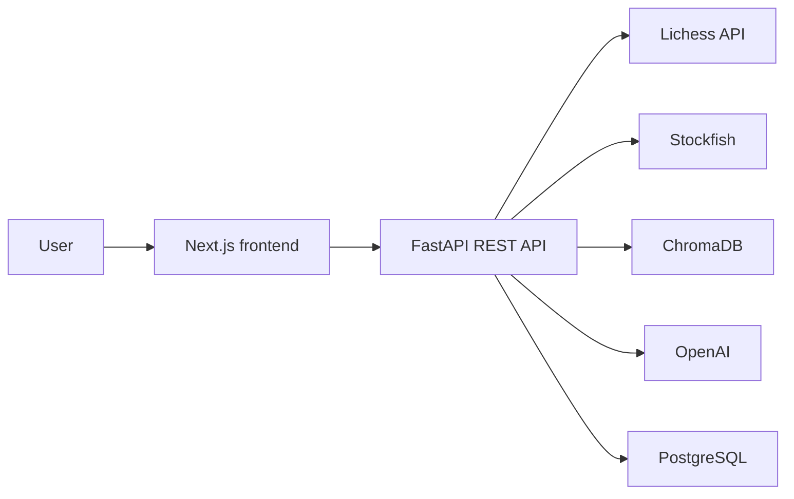
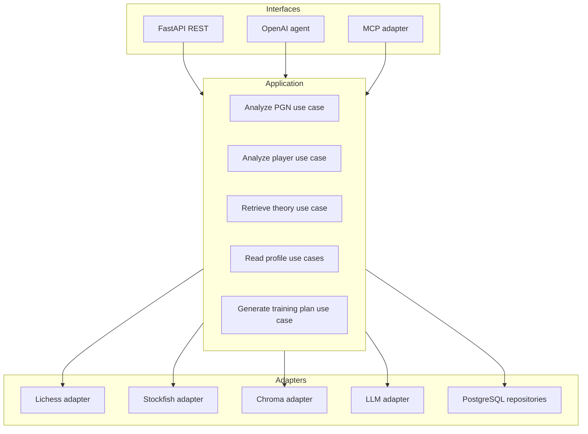

# Cerno architecture

**Status:** Current-state reference and approved target architecture
**Audience:** Contributors, reviewers, and technical interviewers
**Last reviewed:** 2026-07-29

## 1. Purpose

This document describes how Cerno works today, the correctness constraints that must be preserved, and the target architecture for its professionalization. It does not claim that future capabilities such as grounded generation or MCP already exist.

Implementation sequencing and acceptance criteria are defined in [professionalization-plan.md](./professionalization-plan.md). Specialist designs live in the testing, RAG, prompt, and MCP documents.

## 2. System context

Cerno is a chess analysis and training application with:

- a Next.js/React frontend;
- a FastAPI backend;
- Stockfish analysis;
- Lichess game retrieval;
- ChromaDB semantic retrieval;
- optional OpenAI generation;
- PostgreSQL persistence;
- Docker Compose for local orchestration.



## 3. Current architecture

### 3.1 Frontend

The frontend is implemented in [`frontend/src`](../frontend/src):

- [`analysis-workspace.tsx`](../frontend/src/components/analysis-workspace.tsx) coordinates Lichess and PGN analysis flows.
- [`game-viewer.tsx`](../frontend/src/components/game-viewer.tsx) displays positions, navigation, move lists, orientation, and critical moments.
- `chess.js` reconstructs positions from PGN when engine FEN data is unavailable.
- `react-chessboard` renders the board.
- [`api.ts`](../frontend/src/lib/api.ts) calls the REST API.
- [`types.ts`](../frontend/src/lib/types.ts) manually mirrors backend response contracts.

The frontend uses TypeScript strict mode and currently has lint, explicit
`tsc --noEmit`, and production-build validation, but no automated component or
browser tests.

### 3.2 REST API

[`app/main.py`](../app/main.py) creates the FastAPI application and mounts routers for:

- games and PGN analysis;
- the structured coach flow;
- the experimental agent;
- theory search and indexing;
- persisted user analyses and weakness profiles;
- health.

The OpenAPI schema currently exposes ten paths. Frontend types are not generated from that schema, so contract drift is possible.

### 3.3 Stockfish analysis

[`app/services/stockfish.py`](../app/services/stockfish.py) parses PGN with `python-chess`, launches Stockfish, and records every ply:

- move number;
- UCI and SAN;
- phase;
- evaluation before and after;
- centipawn loss;
- classification;
- FEN before and after.

All plies are required by the board viewer. Since Phase 1, every move exposes
`mover_color` as either `white` or `black`.

### 3.4 Structured coach flow

[`app/services/coach.py`](../app/services/coach.py) currently:

1. retrieves recent Lichess games;
2. analyzes each complete PGN;
3. resolves the requested user's color from the game participants;
4. derives a player-only projection while retaining the complete analysis;
5. aggregates weaknesses from the player-only projections;
6. generates theory queries;
7. searches ChromaDB;
8. builds theory recommendations;
9. generates a training plan with OpenAI or a local fallback;
10. optionally persists the player-specific result.

This is the primary product flow because it has a bounded, structured response.

### 3.5 Weakness aggregation

[`app/services/weakness.py`](../app/services/weakness.py) aggregates move metrics by opening, middlegame, and endgame. It computes:

- average CPL;
- inaccuracies;
- mistakes;
- blunders;
- primary and secondary weaknesses;
- detected patterns;
- recommended focus;
- theory queries.

### 3.6 RAG

[`app/services/rag.py`](../app/services/rag.py) creates a process-global persistent ChromaDB collection using the default embedding function. It downloads Lichess study PGN, splits it into chapter-sized documents, upserts documents and metadata, and performs dense top-k search.

The current system performs semantic retrieval and exposes sources. The structured coach passes derived theory themes to the LLM, not the retrieved passages themselves. The current description is therefore **retrieval-assisted coaching**, not fully grounded RAG.

The target design is specified in [rag-improvement-plan.md](./rag-improvement-plan.md).

### 3.7 OpenAI agent

[`app/services/agent.py`](../app/services/agent.py) defines `fetch_games`, `analyze_game`, and `search_theory` as OpenAI function-calling tools. The backend executes selected functions in an unbounded loop.

This is provider-specific internal function calling. It is not MCP:

- there is no MCP initialization;
- there is no tool discovery endpoint;
- there is no JSON-RPC MCP server;
- there is no `stdio` or Streamable HTTP transport;
- there are no MCP resources, client tests, or Inspector evidence.

### 3.8 Persistence

[`app/db/models.py`](../app/db/models.py) defines PostgreSQL models for:

- users;
- game analyses;
- critical move analyses;
- weakness profiles;
- training recommendations;
- agent sessions.

The coach can persist analyses transactionally when `save=true`. Agent-session persistence exists as a repository function but is not connected to the current agent flow.

### 3.9 Local infrastructure

Docker Compose runs:

- Next.js on port 3000;
- FastAPI on port 8000;
- PostgreSQL on port 5432;
- ChromaDB embedded in the API process with local volume persistence.

The current `/health` route proves that the API process responds. It does not prove readiness of PostgreSQL, ChromaDB, Stockfish, Lichess, or OpenAI.

### 3.10 Automated quality boundary

Phase 2A adds deterministic constraints around the current architecture:

- Ruff owns Python linting, import order, and formatting.
- mypy checks all application and script modules without module exclusions.
- pytest measures line and branch coverage of `app/` and enforces the measured
  70% baseline.
- `scripts/quality.py` exposes the same backend and frontend targets on Windows,
  Linux, and GitHub Actions.
- `.github/workflows/quality.yml` runs independent backend and frontend jobs on
  relevant pushes and pull requests.

This boundary verifies static quality, the existing isolated backend suite, and
the frontend production build. It does not yet prove real PostgreSQL, ChromaDB,
expanded Stockfish, browser, or API-contract integration; those remain later
Phase 2 work. The workflow is locally validated, but its first hosted execution
is pending until the branch is pushed.

## 4. Phase 1 correctness status

### 4.1 Player and opponent separation

**Status:** Resolved in Phase 1.

The original bug occurred because the coach passed the full engine analysis directly
to `aggregate_game_analyses`; player color was only calculated later while building
the viewer response. Opponent moves could therefore influence every downstream
coaching result.

The implemented flow now:

1. records `mover_color` at the Stockfish boundary;
2. derives the requested user's color from the White and Black participants;
3. rejects a game for personal analysis when that identity is ambiguous or absent;
4. creates a separate player-only projection;
5. uses that projection for metrics, personal critical moments, theory queries,
   generated coaching, and persistence;
6. returns the original complete analysis in `game_analyses` for the viewer.

### Preserved invariant

Two views of the same game must coexist:

```text
Full game view     -> every ply -> board, replay, complete engine report
Player profile view -> own plies -> diagnosis, personal moments, RAG, training
```

The full game must not be truncated to solve the player-profile bug.

### 4.2 Best-phase evidence

**Status:** Resolved in Phase 1.

The original normalized phase contract discarded `moves`, although
`detect_best_phase` required that field. Normalized phase statistics now retain
their move count. Best-phase comparison includes only phases with at least one
analyzed player move and selects the lowest average CPL among those phases. Empty
or legacy inputs without move evidence return no best phase.

Phase 1 deliberately does not introduce an arbitrary higher sample-size threshold.
Statistical confidence thresholds remain a future evidence-based product decision.

## 5. Target architecture

The target is an incremental separation of application logic from delivery interfaces, not a wholesale rewrite.



### 5.1 Application services

Shared use cases must own business behavior and typed inputs/outputs. REST, the internal agent, and MCP should translate transport concerns and delegate to these services.

Examples of shared capabilities:

- analyze a full PGN;
- derive a player-specific view;
- analyze recent Lichess games;
- retrieve theory with evidence status;
- generate a validated training plan;
- read persisted profiles and analyses.

### 5.2 Adapters

External and infrastructure concerns should remain behind narrow boundaries:

- Lichess HTTP and rate limiting;
- Stockfish process lifecycle;
- Chroma indexing and retrieval;
- OpenAI generation;
- PostgreSQL repositories.

Tests should be able to replace an adapter without replacing the application logic under test.

### 5.3 Interfaces

- **REST:** remains the web application's interface.
- **OpenAI agent:** may continue to call shared services directly; it is not required to call Cerno through MCP.
- **MCP:** becomes a thin external adapter after the shared services are stable.

### 5.4 Cross-cutting capabilities

The target architecture includes:

- typed contracts;
- prompt registry and prompt versions;
- retrieval/index versions;
- structured errors;
- authentication and authorization;
- quotas and concurrency controls;
- timeout and cancellation;
- structured logging, metrics, and traces;
- liveness and readiness health checks.

## 6. Data and contract boundaries

### 6.1 Full analysis versus player analysis

A standalone PGN has no inherent "user." A player-specific diagnosis is valid only when Cerno receives or can derive the player's color.

Target contracts must distinguish:

- full-game engine output;
- optional player-specific projection;
- aggregated multi-game player profile.

MCP and REST must not label a full-game error as "the player's error" without explicit player identity.

### 6.2 Retrieval outcome

Theory retrieval must eventually return an explicit outcome:

```text
evidence_found
insufficient_evidence
```

Returning the nearest vector is not equivalent to having sufficient evidence.

### 6.3 Generation outcome

Generated recommendations must distinguish:

- engine evidence;
- retrieved theory evidence;
- generated pedagogical explanation;
- fallback generation;
- missing evidence.

Structured citations must refer to source records that were actually provided to the generator.

## 7. Security boundaries

Current REST routes do not implement application authentication. CORS is not an authorization boundary.

Target controls include:

- administrative protection for indexing;
- explicit authorization for persisted user data if it is private;
- PGN and message size limits;
- Stockfish concurrency limits;
- request timeout and cancellation;
- per-user or per-IP quotas;
- safe handling of external PGN comments and study text;
- HTTPS, Origin validation, and OAuth-compatible authorization for remote MCP.

RAG indexing must not be exposed as a public MCP tool.

## 8. Evolution constraints

- Fix correctness before changing retrieval, prompts, agent orchestration, or MCP.
- Add automated constraints before broad refactors.
- Preserve the full board-viewer contract while introducing player-specific projections.
- Keep `save=false` as the default for analysis interfaces.
- Do not select advanced retrieval techniques until the evaluation dataset shows a measurable need.
- Do not claim grounded RAG until retrieved passages reach the model and citations are validated.
- Do not claim MCP until a conforming server, transport, discovery, calls, client, and tests exist.

## 9. Related documents

- [Professionalization plan](./professionalization-plan.md)
- [Testing strategy](./testing-strategy.md)
- [RAG improvement plan](./rag-improvement-plan.md)
- [Prompt engineering plan](./prompt-engineering-plan.md)
- [MCP integration plan](./mcp-integration-plan.md)
- [Decision log](./decision-log.md)
