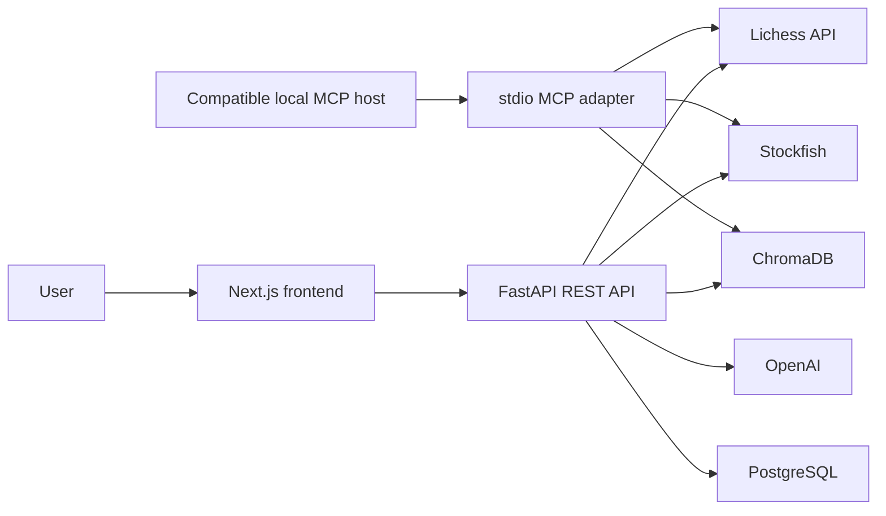
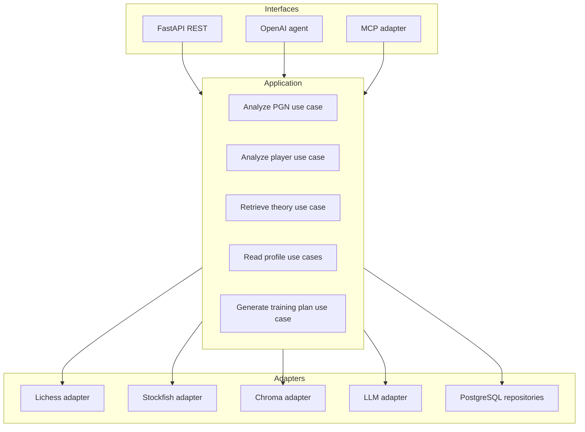

# Cerno architecture

**Status:** Current-state reference and approved target architecture
**Audience:** Contributors, reviewers, and technical interviewers
**Last reviewed:** 2026-08-01

## 1. Purpose

This document describes how Cerno works today, the correctness constraints that
must be preserved, and the target architecture for its professionalization.
The structured coach has grounded generation, and Cerno exposes a bounded local
MCP adapter over the existing application services.

Implementation sequencing and acceptance criteria are defined in [professionalization-plan.md](./professionalization-plan.md). Specialist designs live in the testing, RAG, prompt, and MCP documents.

## 2. System context

Cerno is a chess analysis and training application with:

- a Next.js/React frontend;
- a FastAPI backend;
- Stockfish analysis;
- Lichess game retrieval;
- ChromaDB semantic retrieval;
- optional OpenAI generation;
- a local `stdio` MCP server;
- PostgreSQL persistence;
- Docker Compose for local orchestration.



## 3. Current architecture

### 3.1 Frontend

The frontend is implemented in [`frontend/src`](../frontend/src):

- [`analysis-workspace.tsx`](../frontend/src/components/analysis-workspace.tsx) coordinates Lichess and PGN analysis flows.
- [`game-viewer.tsx`](../frontend/src/components/game-viewer.tsx) displays positions, navigation, move lists, orientation, and critical moments.
- `chess.js` reconstructs positions from PGN when engine FEN data is unavailable.
- `react-chessboard` renders the board.
- [`api.ts`](../frontend/src/lib/api.ts) calls the REST API.
- [`types.ts`](../frontend/src/lib/types.ts) manually mirrors backend response contracts.

Both analysis inputs render the same seven-part coaching composition: report
status, coach reading, diagnosis, weaknesses, detected patterns, interactive
board, and training direction. The final section exposes distinct retrieved
studies and highlights the single study selected by the grounded coach as the
best starting point. Critical moments remain board navigation and return focus
and viewport to the selected position.

The frontend uses TypeScript strict mode. Vitest and React Testing Library cover
deterministic helpers, the API client, forms, result states, the player profile,
and the game viewer. MSW rejects unexpected frontend HTTP traffic. Playwright
runs the production build against the real FastAPI application and Stockfish;
only the outbound Lichess endpoint is replaced by a controlled local NDJSON
server.

The viewer's deterministic PGN/FEN, move-grouping, and critical-ply functions
live in [`frontend/src/lib/game-viewer.ts`](../frontend/src/lib/game-viewer.ts).
The React component retains rendering and interaction state. This split changes
no response contract or chessboard library.

### 3.2 REST API

[`app/main.py`](../app/main.py) creates the FastAPI application and mounts routers for:

- games and PGN analysis;
- the structured coach flow;
- the experimental agent;
- theory search and indexing;
- persisted user analyses and weakness profiles;
- health.

The OpenAPI schema currently exposes eleven paths. Frontend types are not
generated from that schema, so contract drift is possible.

`POST /games/analyze` remains the low-level full-game engine endpoint and
returns additive neutral coaching. The product analysis workspace does not use
that neutral report as an alternative UI. It sends pasted games to
`POST /coach/analyze-pgn`, together with the explicitly selected player color,
and receives the same structured coach response used by
`POST /coach/analyze-user`. The selector prevents Cerno from attributing an
arbitrary side's errors to the user.

### 3.3 Stockfish analysis

[`app/services/stockfish.py`](../app/services/stockfish.py) parses PGN with `python-chess`, launches Stockfish, and records every ply:

- move number;
- UCI and SAN;
- phase;
- evaluation before and after;
- centipawn loss;
- classification;
- FEN before and after.

All plies are required by the board viewer. Since Phase 1, every move exposes
`mover_color` as either `white` or `black`.

### 3.4 Structured coach flow

[`app/services/coach.py`](../app/services/coach.py) currently:

1. accepts recent games retrieved from Lichess or one uploaded PGN;
2. analyzes each complete PGN;
3. resolves the requested user's color from the Lichess participants or uses
   the explicit uploaded-PGN selection;
4. derives a player-only projection while retaining the complete analysis;
5. aggregates weaknesses from the player-only projections;
6. generates theory queries;
7. searches ChromaDB;
8. passes bounded retrieved chunks and source metadata to the grounded coach
   generator;
9. validates a player-specific coaching summary, weaknesses, actionable
   recommendations, a single cited starting study, and source references, or
   uses a deterministic fallback;
10. derives the existing training-plan fields from that validated result;
11. optionally persists the player-specific result.

This is the primary product flow because it has a bounded, structured response.
Both product entry points share this service and return the same response
contract. Uploaded reports are non-persistent and contain one game.

[`app/prompts/coach.py`](../app/prompts/coach.py) owns the stable English
developer instructions and prompt version. Dynamic player labels, deterministic
analysis, engine evidence, and retrieved passages are serialized separately.
Player labels and retrieved passages are explicitly untrusted data. The service
uses the OpenAI SDK's Pydantic Structured Outputs path and validates all engine
and source IDs again before a response reaches the API.

The additive response fields expose grounding status, strengths, weaknesses,
actionable recommendations, source attribution, and generation metadata. The
existing diagnosis, theory recommendations, training plan, and full-game
analysis remain available for compatibility. Both Lichess and PGN use this
identical response contract.

### 3.5 Weakness aggregation

[`app/services/weakness.py`](../app/services/weakness.py) aggregates move metrics by opening, middlegame, and endgame. It computes:

- average CPL;
- inaccuracies;
- mistakes;
- blunders;
- primary and secondary weaknesses;
- detected patterns;
- recommended focus;
- theory queries.

### 3.6 RAG

[`app/services/rag.py`](../app/services/rag.py) lazily creates the product's
persistent ChromaDB collection using the default embedding function. It
downloads only manifest-approved sources. The active corpus is Lichess-only:
study PGN is parsed with `python-chess` into bounded content-addressed chunks
that record source, chapter, category, phase, topic, author, attribution URL,
content-license status, content hash, and pipeline/embedding versions. Optional
chapter allowlists keep mixed-topic studies inside their declared category.
The existing pinned-Wikimedia adapter remains tested but has no active manifest
source.
Source reindexing is idempotent and removes stale chunks; the separate
reconciliation command reports drift and deletes only orphaned or
manifest-obsolete content when `--apply` is explicit.

Retrieval first applies available phase/category metadata and then a calibrated
distance gate calibrated on a dedicated dataset, separate from the held-out
evaluation set. Its internal result is typed as `evidence_found` or
`insufficient_evidence`. Existing REST, coach, and agent consumers retain their
list contract: insufficient evidence is adapted to an empty list. The
collection factory accepts an explicit path and embedding function so tests use
isolated storage without opening the developer's `data/chromadb`.

RAG queries, indexed source prose, and human-readable metadata are currently
English-only. Multilingual retrieval and translation are outside the current
architecture.

The current system performs semantic retrieval with abstention. When evidence
exists, the structured coach consumes up to five bounded passages with stable
`S1`-style IDs, source title/chapter, phase/category, author, attribution,
license, and canonical URL. Theory recommendations must cite supplied IDs;
application validation rejects invented references. Engine-derived
recommendations use `E1`-style game-analysis IDs and do not cite RAG sources.

When retrieval returns `insufficient_evidence`, coaching remains useful and
deterministic from Stockfish/profile data, contains no theory recommendation or
source citation, and states that no relevant theory source was available.

The target design is specified in [rag-improvement-plan.md](./rag-improvement-plan.md).

### 3.7 OpenAI agent

[`app/services/agent.py`](../app/services/agent.py) defines `fetch_games`,
`analyze_game`, and `search_theory` as typed OpenAI function-calling tools. The
agent is an experimental portfolio demonstration and is not called by the
frontend or structured coach. `/agent/chat` is disabled by default and returns
a controlled `503` unless `ENABLE_EXPERIMENTAL_AGENT=true`.

When explicitly enabled, the English-only agent has a maximum of six model
iterations and a 90-second total timeout. Pydantic validates tool arguments and
typed results before they become tool messages. Invalid arguments, unknown
tools, and service failures become sanitized structured errors. Stockfish
results include only the summary, phase weaknesses, and ten largest critical
moments rather than the full move/FEN payload.

This remains provider-specific internal function calling rather than MCP. The
agent has its own OpenAI-facing tool loop and does not call, host, or proxy the
separate MCP server described below.

### 3.8 Local MCP server

[`app/mcp_server.py`](../app/mcp_server.py) is a thin local adapter implemented
with the official Python MCP SDK. It publishes Pydantic-derived discovery
schemas and exactly three read-only tools over `stdio`:

- `analyze_pgn` for neutral or explicitly color-scoped PGN analysis;
- `analyze_lichess_player` for at most three recent public games;
- `search_chess_theory` for bounded English-only retrieval with explicit
  insufficient evidence.

The analysis tools delegate to the existing coach, Stockfish, Lichess,
weakness, and RAG services. The only service-level switch added for this
adapter disables LLM generation while preserving the REST default. MCP calls
are always non-persistent, do not connect to the OpenAI generator, do not
expose the move/FEN viewer payload, and cannot mutate or reindex ChromaDB.

[`app/schemas/mcp.py`](../app/schemas/mcp.py) defines compact tool output
envelopes and sanitized stable errors. PGN size, engine depth, game count,
result count, and execution time are bounded in the adapter. Retrieved study
fragments are explicitly marked untrusted.

There is no network listener, HTTP/SSE transport, authentication, resources,
or MCP prompts in this release. A real official `ClientSession` test starts
the server as a subprocess and verifies initialization, discovery, and schemas;
protocol call tests cover all tools, timeouts, cancellation, and error mapping.
Operational configuration is documented in
[`mcp-local-server.md`](./mcp-local-server.md).

### 3.9 Persistence

[`app/db/models.py`](../app/db/models.py) defines PostgreSQL models for:

- users;
- game analyses;
- critical move analyses;
- weakness profiles;
- training recommendations;
- agent sessions.

The coach can persist analyses transactionally when `save=true`. Agent-session persistence exists as a repository function but is not connected to the current agent flow.

Alembic migration `0002_timestamp_columns_not_null` aligns the database with the
ORM's non-null timestamp contract. It fills any historical null timestamp before
applying the constraint.

### 3.10 Local infrastructure

Docker Compose runs:

- Next.js on port 3000;
- FastAPI on port 8000;
- PostgreSQL on port 5432;
- ChromaDB embedded in the API process with local volume persistence.

The current `/health` route proves that the API process responds. It does not prove readiness of PostgreSQL, ChromaDB, Stockfish, Lichess, or OpenAI.

`docker-compose.integration.yml` is separate from that product stack. It starts
only an ephemeral PostgreSQL 16 database named `cerno_test` on local port 55432,
stores its data in tmpfs, and uses a distinct Compose project. Integration
fixtures reject non-local targets, any database name other than `cerno_test`,
and the URL configured for the application.

Frontend E2E uses a third isolated boundary without Docker:

```text
Next production build :3100
  -> FastAPI :8100
     -> real Stockfish at depth 1
     -> temporary empty Chroma directory
     -> local Lichess fixture server :4300
```

The fixture server replaces only Lichess HTTP. `LICHESS_API_BASE_URL` defaults
to `https://lichess.org` in every product environment. The browser-test runner
creates and removes its temporary Chroma directory even when Playwright fails.
No E2E path uses Railway, a developer database, the developer Chroma index, or
external credentials.

### 3.11 Automated quality boundary

Phase 2A adds deterministic constraints around the current architecture:

- Ruff owns Python linting, import order, and formatting.
- mypy checks all application and script modules without module exclusions.
- pytest measures line and branch coverage of `app/` and enforces the measured
  70% baseline.
- `scripts/quality.py` exposes the same backend and frontend targets on Windows,
  Linux, and GitHub Actions.
- `.github/workflows/quality.yml` runs independent backend and frontend jobs on
  relevant pushes and pull requests.

Phase 2B adds a separate real-integration boundary:

```text
PostgreSQL 16 -> blank schema -> Alembic head -> repositories -> commit/rollback
pytest tmp_path -> persistent Chroma -> controlled corpus -> query/reopen
real Stockfish -> depth 1 -> full move/FEN/ownership invariants
```

The fast backend job remains isolated for early feedback. A
`backend-integration` job provides PostgreSQL, installs Stockfish, and runs the
complete suite without secrets or live APIs. All three Phase 2A/2B jobs are
green locally and in GitHub Actions.

Phase 2C adds a frontend behavioral boundary:

```text
Vitest + jsdom -> pure helpers and React behavior
MSW             -> strict frontend HTTP isolation
vitest-axe      -> basic DOM accessibility checks
Playwright      -> browser + production frontend + FastAPI + Stockfish
```

The `frontend` job now runs 64 Vitest cases with line and branch coverage before
the Next production build. The separate `frontend-e2e` job installs Chromium
and Stockfish, serves the generated Next `standalone` application, runs four
browser scenarios, and uploads the HTML report, traces, screenshots, and
retained failure videos. Local evidence is green; the new hosted job awaits its
first push.

## 4. Phase 1 correctness status

### 4.1 Player and opponent separation

**Status:** Resolved in Phase 1.

The original bug occurred because the coach passed the full engine analysis directly
to `aggregate_game_analyses`; player color was only calculated later while building
the viewer response. Opponent moves could therefore influence every downstream
coaching result.

The implemented flow now:

1. records `mover_color` at the Stockfish boundary;
2. derives the requested user's color from the White and Black participants;
3. rejects a game for personal analysis when that identity is ambiguous or absent;
4. creates a separate player-only projection;
5. uses that projection for metrics, personal critical moments, theory queries,
   generated coaching, and persistence;
6. returns the original complete analysis in `game_analyses` for the viewer.

### Preserved invariant

Two views of the same game must coexist:

```text
Full game view     -> every ply -> board, replay, complete engine report
Player profile view -> own plies -> diagnosis, personal moments, RAG, training
```

The full game must not be truncated to solve the player-profile bug.

### 4.2 Best-phase evidence

**Status:** Resolved in Phase 1.

The original normalized phase contract discarded `moves`, although
`detect_best_phase` required that field. Normalized phase statistics now retain
their move count. Best-phase comparison includes only phases with at least one
analyzed player move and selects the lowest average CPL among those phases. Empty
or legacy inputs without move evidence return no best phase.

Phase 1 deliberately does not introduce an arbitrary higher sample-size threshold.
Statistical confidence thresholds remain a future evidence-based product decision.

## 5. Target architecture

The target is an incremental separation of application logic from delivery interfaces, not a wholesale rewrite.



### 5.1 Application services

Shared use cases must own business behavior and typed inputs/outputs. REST, the internal agent, and MCP should translate transport concerns and delegate to these services.

Examples of shared capabilities:

- analyze a full PGN;
- derive a player-specific view;
- analyze recent Lichess games;
- retrieve theory with evidence status;
- generate a validated training plan;
- read persisted profiles and analyses.

### 5.2 Adapters

External and infrastructure concerns should remain behind narrow boundaries:

- Lichess HTTP and rate limiting;
- Stockfish process lifecycle;
- Chroma indexing and retrieval;
- OpenAI generation;
- PostgreSQL repositories.

Tests should be able to replace an adapter without replacing the application logic under test.

### 5.3 Interfaces

- **REST:** remains the web application's interface.
- **OpenAI agent:** may continue to call shared services directly; it is not required to call Cerno through MCP.
- **MCP:** is a thin local external adapter over the shared services; any remote
  transport remains a later, separately secured phase.

### 5.4 Cross-cutting capabilities

The target architecture includes:

- typed contracts;
- prompt registry and prompt versions;
- retrieval/index versions;
- structured errors;
- authentication and authorization;
- quotas and concurrency controls;
- timeout and cancellation;
- structured logging, metrics, and traces;
- liveness and readiness health checks.

## 6. Data and contract boundaries

### 6.1 Full analysis versus player analysis

A standalone PGN has no inherent "user." A player-specific diagnosis is valid only when Cerno receives or can derive the player's color.

Target contracts must distinguish:

- full-game engine output;
- optional player-specific projection;
- aggregated multi-game player profile.

MCP and REST must not label a full-game error as "the player's error" without explicit player identity.

### 6.2 Retrieval outcome

Theory retrieval must eventually return an explicit outcome:

```text
evidence_found
insufficient_evidence
```

Returning the nearest vector is not equivalent to having sufficient evidence.

### 6.3 Generation outcome

Generated recommendations must distinguish:

- engine evidence;
- retrieved theory evidence;
- generated pedagogical explanation;
- fallback generation;
- missing evidence.

Structured citations must refer to source records that were actually provided to the generator.

## 7. Security boundaries

Current REST routes do not implement application authentication. CORS is not an authorization boundary.

Target controls include:

- administrative protection for indexing;
- explicit authorization for persisted user data if it is private;
- PGN and message size limits;
- Stockfish concurrency limits;
- request timeout and cancellation;
- per-user or per-IP quotas;
- safe handling of external PGN comments and study text;
- HTTPS, Origin validation, and OAuth-compatible authorization for remote MCP.

RAG indexing must not be exposed as a public MCP tool.

## 8. Evolution constraints

- Fix correctness before changing retrieval, prompts, agent orchestration, or MCP.
- Add automated constraints before broad refactors.
- Preserve the full board-viewer contract while introducing player-specific projections.
- Keep `save=false` as the default for analysis interfaces.
- Do not select advanced retrieval techniques until the evaluation dataset shows a measurable need.
- Do not claim grounded RAG until retrieved passages reach the model and citations are validated.
- Do not claim MCP until a conforming server, transport, discovery, calls, client, and tests exist.

## 9. Related documents

- [Professionalization plan](./professionalization-plan.md)
- [Testing strategy](./testing-strategy.md)
- [RAG improvement plan](./rag-improvement-plan.md)
- [Prompt engineering plan](./prompt-engineering-plan.md)
- [MCP integration plan](./mcp-integration-plan.md)
- [Decision log](./decision-log.md)
