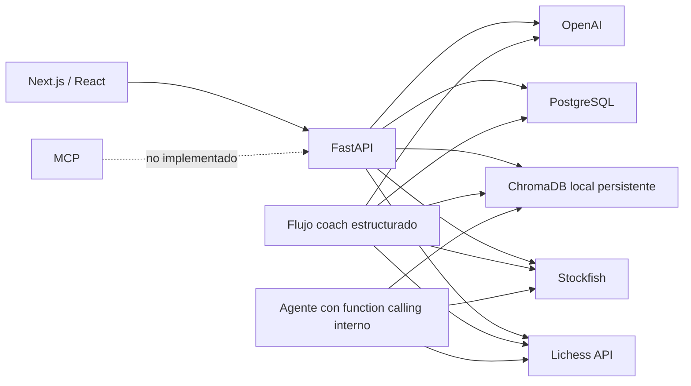
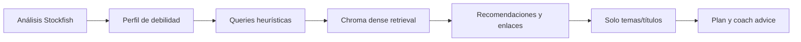

# Auditoría técnica de Cerno: testing, RAG, agentes y MCP

**Fecha de auditoría:** 28 de julio de 2026  
**Repositorio:** Cerno  
**Base revisada:** `e7e6dae` más los cambios locales sin commit indicados en la sección 2.3  
**Ámbito:** backend FastAPI, frontend Next.js, Stockfish, Lichess, PostgreSQL, ChromaDB, capa LLM/agente, Docker y posible adopción de MCP.

## 1. Resumen ejecutivo

Cerno es un MVP funcional y coherente como producto: puede importar partidas de Lichess, analizar PGN con Stockfish, mostrar un tablero sincronizado, agregar métricas por fase, recuperar teoría desde ChromaDB y generar un plan de entrenamiento con OpenAI o con un fallback local.

El proyecto compila, la infraestructura local está sana y las 21 pruebas backend pasan. Sin embargo, todavía no tiene una estrategia de calidad suficiente para considerarlo un sistema de análisis de ajedrez fiable en producción. La principal brecha no es el número total de tests, sino que las pruebas actuales sustituyen con mocks precisamente los componentes donde está el mayor riesgo: Stockfish, ChromaDB, PostgreSQL, OpenAI y gran parte de la orquestación.

### Estado por área

| Área | Estado | Conclusión |
| --- | --- | --- |
| Docker local | Verde | Frontend, API y PostgreSQL están saludables. |
| Build frontend | Verde | ESLint, TypeScript estricto y build de Next.js pasan. |
| Tests backend | Ámbar | 21 tests rápidos y útiles, pero con cobertura funcional estrecha y sin medición de cobertura. |
| Tests frontend | Rojo | No existe framework ni suite de tests. |
| Tests de integración/E2E | Rojo | No hay tests automatizados con Stockfish, ChromaDB, PostgreSQL ni navegador. |
| Correctitud del coaching | Rojo | Se agregan jugadas del usuario y del rival como si todas pertenecieran al usuario. |
| RAG de aperturas | Ámbar | Funciona razonablemente en el índice local para varias consultas de aperturas. |
| RAG de medio juego/finales | Rojo | El corpus no cubre esas fases y devuelve resultados semánticamente engañosos. |
| Generación realmente grounded | Ámbar-rojo | El flujo principal pasa al LLM títulos/temas, no los fragmentos recuperados. |
| MCP | Gris | No está implementado. El function calling interno de OpenAI no es MCP. |
| CI/CD de calidad | Rojo | No existe `.github/workflows` ni otro pipeline de CI en el repositorio. |
| Seguridad/operación | Rojo | Endpoints costosos y de indexación sin autenticación, sin cuotas y con observabilidad mínima. |

### Hallazgos de máxima prioridad

1. **El diagnóstico mezcla los errores del usuario con los del oponente.**  
   Stockfish analiza todos los plies y [`aggregate_game_analyses`](../app/services/weakness.py) agrega todos los movimientos. El flujo de [`analyze_user`](../app/services/coach.py) no filtra por el color del usuario antes de construir su perfil. Esto puede atribuir al jugador una debilidad que realmente pertenece a sus rivales.

2. **La “mejor fase” del consejo fallback nunca se detecta con el contrato actual.**  
   [`detect_best_phase`](../app/services/coach.py) exige `stats["moves"]`, pero las estadísticas normalizadas de [`_normalize_phase_stats`](../app/services/weakness.py) no conservan ese campo.

3. **La base RAG está especializada en aperturas, aunque el producto consulta medio juego y finales.**  
   Las consultas `rook endgame principles` y `king and pawn endings` recuperan capítulos de principios de apertura. Al no existir un umbral o una respuesta “sin evidencia”, esos resultados pueden presentarse como recomendaciones válidas.

4. **El flujo principal no es todavía RAG completo en el sentido de generación fundamentada.**  
   Se recuperan documentos y se muestran enlaces, pero [`build_training_plan_prompt`](../app/services/coach.py) pasa al LLM únicamente `theory_themes`; no incluye el texto recuperado ni citas que permitan comprobar qué afirmación procede de qué fuente.

5. **No existe MCP.**  
   [`app/services/agent.py`](../app/services/agent.py) define herramientas para el function calling de OpenAI, pero no implementa inicialización JSON-RPC, descubrimiento `tools/list`, `tools/call`, recursos, prompts ni transporte MCP.

6. **No hay tests del tablero ni del flujo visible para el usuario.**  
   El componente [`GameViewer`](../frontend/src/components/game-viewer.tsx) contiene lógica relevante —reconstrucción de FEN desde PGN, navegación, orientación, teclado y momentos críticos— sin una sola prueba automatizada.

## 2. Alcance, método y limitaciones

### 2.1 Evidencia revisada

- Código backend en `app/`.
- Código frontend en `frontend/src/`.
- Migración Alembic y repositorios SQLAlchemy.
- Suite completa en `tests/`.
- Scripts y documentación de RAG.
- Dependencias Python y Node.
- Configuración Docker Compose.
- Esquema OpenAPI servido por la API local.
- Índice ChromaDB local montado en `data/chromadb`.
- Especificación y documentación oficial de MCP.

### 2.2 Validaciones ejecutadas

| Validación | Resultado |
| --- | --- |
| `pytest --collect-only -q` | 21 tests descubiertos |
| `pytest -q` | 21 passed |
| `npm run lint` | Correcto |
| `npx tsc --noEmit` | Correcto |
| `npm run build` | Correcto |
| Docker Compose | `frontend`, `api` y `postgres` healthy |
| `alembic current` dentro del contenedor | `0001_initial_schema (head)` |
| Smoke real de `/games/analyze` con Stockfish, profundidad 1 | 4 plies analizados; FEN anterior y posterior presentes |
| Smoke real de `/theory/search` | ChromaDB responde |
| `scripts/test_rag_queries.py` | Ejecutado sobre las 7 queries existentes |
| Inventario MCP | Sin SDK, servidor, manifiesto, endpoint o tests MCP |

### 2.3 Estado Git de la auditoría

La auditoría se ha realizado sobre el working tree, no únicamente sobre el último commit. Existen cambios locales pendientes:

- `app/routers/coach.py`
- `app/routers/games.py`
- `app/services/lichess.py`
- `tests/test_lichess.py` sin seguimiento

Por tanto, los 21 tests incluyen un archivo que todavía no forma parte del historial Git. Antes de configurar CI, estos cambios deben revisarse y versionarse; de lo contrario, el resultado reproducido desde `e7e6dae` será distinto.

### 2.4 Limitaciones de esta auditoría

- No se hizo una llamada de pago a OpenAI.
- No se ejecutó un análisis completo de usuario contra Lichess para evitar consumir límites externos.
- No se modificó ni repobló PostgreSQL.
- El índice `data/` está ignorado por Git. Las cifras RAG corresponden al volumen local actual y no demuestran que Railway u otro entorno tenga el mismo contenido.
- `coverage.py` y `pytest-cov` no están instalados. No existe, por tanto, un porcentaje oficial de cobertura de líneas o ramas.
- No se ejecutó un escáner de vulnerabilidades de dependencias.

## 3. Arquitectura actual



### 3.1 Backend

- FastAPI con 10 rutas OpenAPI.
- Pydantic para requests y parte de las respuestas.
- SQLAlchemy síncrono con PostgreSQL.
- Alembic con una migración inicial.
- Stockfish ejecutado en un thread mediante `asyncio.to_thread`.
- ChromaDB embebido en el proceso API mediante `PersistentClient`.
- OpenAI opcional en `/coach/analyze-user`; obligatorio en `/agent/chat`.

### 3.2 Frontend

- Next.js 16, React 19 y TypeScript con `strict: true`.
- `chess.js` para reconstrucción de posiciones.
- `react-chessboard` para el tablero.
- Cliente API manual con tipos TypeScript escritos a mano.
- Dos rutas de aplicación: `/` y `/player/[username]`.

### 3.3 Persistencia

- PostgreSQL almacena usuarios, análisis, movimientos críticos, perfiles, recomendaciones y sesiones de agente.
- ChromaDB almacena capítulos/partidas de estudios como documentos y sus metadatos.
- No hay tests que demuestren el ciclo completo de persistencia sobre una base real.
- `AgentSession` y `save_agent_session` existen, pero el flujo de agente no los utiliza.

## 4. Estado del testing

### 4.1 Tamaño aproximado

| Grupo | Archivos | Líneas físicas aproximadas |
| --- | ---: | ---: |
| Backend `app/` | 30 | 1.725 |
| Tests Python | 11 | 468 |
| Frontend `frontend/src/` | 18 | 2.292 |

Estas cifras no representan cobertura ejecutada.

### 4.2 Inventario de los 21 tests backend

| Archivo | Casos | Qué comprueba |
| --- | ---: | --- |
| `test_agent.py` | 2 | Error sin API key y delegación del endpoint de indexación |
| `test_coach.py` | 3 | Happy path mockeado, limpieza de IDs y límites de producción |
| `test_config.py` | 2 | Normalización de URL PostgreSQL |
| `test_cors.py` | 1 | Origen local permitido |
| `test_games.py` | 2 | Error PGN y clamp de profundidad con Stockfish mockeado |
| `test_health.py` | 1 | Payload de health |
| `test_lichess.py` | 6 | Parsing NDJSON, cabeceras, errores, conexión y 429 |
| `test_theory.py` | 1 | Forma de la respuesta con búsqueda mockeada |
| `test_users.py` | 2 | Serialización con repositorios mockeados |
| `test_weakness.py` | 1 | Un caso de agregación de debilidades |

### 4.3 Lo que la suite hace bien

- Es rápida: menos de un segundo en la ejecución observada.
- No necesita credenciales ni servicios externos.
- Comprueba códigos HTTP y contratos básicos.
- La integración Lichess tiene cobertura razonable de errores externos.
- Los límites configurables de número de partidas y profundidad tienen al menos una prueba.
- El happy path del coach verifica que el frontend recibirá PGN, movimientos y momentos críticos.

### 4.4 Lo que no está cubierto

#### Motor y exactitud ajedrecística

No hay tests directos para:

- `calculate_cpl`.
- Límites exactos de clasificación en 50/51, 100/101 y 300/301 CPL.
- Detección de fase.
- Scores de mate.
- PGN con FEN inicial, promociones, enroques, en passant o variantes.
- Fallos reales del proceso Stockfish.
- Coherencia de FEN antes/después.
- Mejor jugada o principal variation, que aún no forman parte del contrato.

El smoke test realizado en esta auditoría demuestra que Stockfish funciona localmente, pero no sustituye una prueba automatizada.

#### Perfil de debilidades

Solo existe un ejemplo. Faltan:

- Filtrado por color del usuario.
- Partidas donde el rival comete el único blunder.
- Usuario con negras.
- Partidas perfectas o sin errores.
- Estadísticas vacías.
- Umbrales exactos de patrones.
- Invariantes: contadores no negativos, medias consistentes y suma correcta.

#### Coach y LLM

Faltan:

- Partidas sin PGN.
- Fallo parcial: una partida falla y otra se analiza.
- Todas las partidas fallan.
- Respuesta OpenAI inválida o JSON malformado.
- Fallback sin API key.
- Preservación del idioma.
- `save=true`, commit y rollback.
- Usuario con negras, empate y oponente anónimo.
- Garantía de que no se filtran IDs/fuentes en ningún campo generado.
- Timeout y cancelación.

#### RAG

Los tests de rutas mockean `search_theory` e `index_study`; no ejercitan:

- Parsing y chunking del PGN.
- Metadatos.
- Índice temporal real.
- Modelo de embeddings.
- Recuperación de documentos.
- Idempotencia y eliminación de chunks obsoletos.
- Calidad o relevancia.
- Índice vacío.
- Corrupción/errores de disco.

El script de consultas es una validación manual, no una suite con assertions ni umbrales.

#### PostgreSQL

Los endpoints de usuario mockean los repositorios. No se prueban:

- Migraciones desde una base vacía.
- Constraints y claves foráneas.
- Upsert de análisis y perfil.
- Reemplazo de movimientos críticos.
- Transacción completa del coach.
- Rollback.
- Consultas con datos reales.
- Compatibilidad de JSONB.

#### Agente

No se prueba el bucle real de function calling:

- Secuencia `fetch_games -> analyze_game -> search_theory`.
- Argumentos JSON inválidos.
- Herramienta desconocida.
- Excepción de una herramienta.
- Número máximo de iteraciones.
- Respuesta vacía.
- Coste o timeout.

El `while True` actual no tiene límite de turnos, por lo que un modelo que continúe solicitando herramientas puede generar un bucle costoso.

#### Frontend

No existe ningún archivo `*.test.*` o `*.spec.*` ni dependencia de testing. Faltan pruebas para:

- Formularios Lichess y PGN.
- Estados loading, error, empty y success.
- Cliente API y normalización de errores.
- Cambio entre modos sin alterar resultados previos.
- Historial/perfil.
- Formateadores.
- Accesibilidad.
- Tablero.

El tablero merece tests específicos para:

- Reconstrucción desde FEN del motor.
- Fallback a replay del PGN.
- Posiciones con FEN inicial no estándar.
- Navegación por botones y teclado.
- Salto a momento crítico.
- Agrupación correcta de blancas/negras.
- Orientación del jugador.
- Flip manual.
- Tamaño responsive.
- FEN inválido.

### 4.5 Tipo de tests recomendado

| Capa | Herramienta sugerida | Objetivo |
| --- | --- | --- |
| Unidad Python | `pytest`, `pytest-asyncio`, Hypothesis | Heurísticas, contratos, edge cases e invariantes |
| Cobertura Python | `coverage.py` / `pytest-cov` | Línea y rama, con reporte XML/HTML |
| Integración Python | PostgreSQL y Chroma temporales; Stockfish real | Verificar adaptadores y persistencia |
| Contrato API | OpenAPI snapshot o cliente generado | Evitar drift backend/frontend |
| Unidad frontend | Vitest + React Testing Library | Componentes, hooks y utilidades |
| Mock de API frontend | MSW | Flujos sin depender del backend |
| Accesibilidad | `axe-core` / `vitest-axe` | Violaciones automáticas básicas |
| E2E | Playwright | Flujos reales en Docker |
| Mutación | `mutmut` o equivalente | Comprobar que los tests detectan cambios en umbrales |
| Rendimiento | smoke con tiempos y presupuestos | Evitar análisis que bloqueen o excedan timeout |

### 4.6 Pirámide mínima propuesta

1. **Unidad:** funciones puras de Stockfish, weakness, parsing, prompts y formatters.
2. **Integración:** Chroma temporal, PostgreSQL real, Stockfish real a profundidad baja.
3. **Contrato:** OpenAPI contra tipos/clientes del frontend.
4. **E2E:** PGN, Lichess mockeado y navegación del tablero.
5. **Evaluación AI/RAG:** corpus golden separado de los tests deterministas.

### 4.7 Quality gate recomendado para CI

Cada pull request debería ejecutar:

```text
backend lint/typecheck
backend unit tests + branch coverage
frontend lint
frontend TypeScript
frontend unit/component tests
frontend production build
OpenAPI contract check
one Stockfish smoke test
one Chroma integration test
Alembic upgrade on an empty PostgreSQL service
```

Los tests LLM, la evaluación RAG completa y pruebas live de Lichess deberían ejecutarse en un workflow programado o manual, no en cada PR.

## 5. Defectos de correctitud detectados

### 5.1 P0: se analizan como propias las jugadas del rival

Flujo actual:

1. [`stockfish.py`](../app/services/stockfish.py) analiza cada ply desde la perspectiva de quien mueve.
2. El resultado no incluye explícitamente `mover_color`.
3. [`analyze_user`](../app/services/coach.py) agrega el análisis completo.
4. [`aggregate_game_analyses`](../app/services/weakness.py) suma todos los movimientos sin conocer el color del usuario.

Consecuencias:

- CPL y errores del rival alteran la fase débil.
- Los momentos críticos del rival pueden presentarse como errores del usuario.
- Las queries RAG y el plan de entrenamiento pueden partir de un diagnóstico equivocado.

Corrección propuesta:

- Añadir `mover_color` a cada movimiento o derivarlo de forma inequívoca.
- Determinar `player_color` antes de agregar.
- Filtrar métricas y momentos críticos a los plies del usuario.
- Mantener el análisis completo para el visor, pero construir el perfil solo con los movimientos propios.

Tests de aceptación:

- Si el usuario juega perfecto y el rival comete un blunder, el perfil del usuario debe registrar cero blunders.
- Repetir el caso con el usuario llevando negras.
- El visor debe seguir mostrando todos los plies.

### 5.2 P0: fortaleza relativa siempre ausente en fallback

`detect_best_phase` filtra con:

```python
if stats.get("moves", 0)
```

pero `_normalize_phase_stats` devuelve `avg_cpl`, `inaccuracies`, `mistakes` y `blunders`, sin `moves`.

Corrección propuesta:

- Conservar `moves` en el contrato normalizado, o
- cambiar la condición a evidencia realmente disponible.

Debe añadirse un test donde apertura tenga menor CPL que medio juego y verificar que el consejo menciona apertura como fase comparativamente estable.

### 5.3 P1: health check superficial

`/health` devuelve un objeto constante. Un contenedor puede aparecer healthy aunque:

- PostgreSQL no acepte consultas.
- Stockfish no exista.
- ChromaDB no sea escribible.

Conviene separar:

- `/health/live`: proceso vivo.
- `/health/ready`: dependencias indispensables listas.

Chroma u OpenAI podrían ser degradables dependiendo del modo de operación.

### 5.4 P1: coste y latencia del motor

Para cada ply se calcula la posición antes y después, por lo que se realizan aproximadamente dos análisis por movimiento. La evaluación posterior de un ply está estrechamente relacionada con la evaluación previa del siguiente y actualmente se recalcula.

Además, se inicia un proceso Stockfish por partida. Antes de optimizar debe añadirse instrumentación de duración por partida, plies y profundidad.

## 6. Estado del RAG

### 6.1 Flujo actual



El sistema sí realiza recuperación semántica. Sin embargo:

- Los documentos completos recuperados no llegan al prompt principal.
- El LLM recibe temas derivados de metadatos.
- Las fuentes se muestran por separado al usuario.

La descripción más precisa hoy es **retrieval-assisted coaching con fuentes**, no generación plenamente fundamentada en contexto recuperado.

### 6.2 Estado real del índice local

| Métrica | Valor |
| --- | ---: |
| Chunks totales | 360 |
| `study_id` distintos | 15 |
| Chunks `general_openings` | 183 |
| Chunks `opening_repertoire` | 124 |
| Chunks `opening_principles` | 36 |
| Chunks `opening_training` | 15 |
| Chunks sin categoría | 2 |
| Capítulos `unknown` | 0 |

Distribución aproximada:

- 50,8 % `general_openings`
- 34,4 % `opening_repertoire`
- 10,0 % `opening_principles`
- 4,2 % `opening_training`
- 0,6 % sin categoría

Todo el catálogo categorizado está relacionado con aperturas.

### 6.3 Drift y residuos del índice

El manifiesto actual contiene 15 IDs. En el volumen local:

- Falta `6XvaoT1n`, ya documentado como fallo HTTP 403.
- Existe `lVCUmd79`, que no pertenece al manifiesto actual.
- Sus dos chunks solo tienen `study_id`, sin categoría, capítulo, fuente ni tipo.

La explicación probable es que `upsert` actualiza IDs presentes, pero no elimina chunks de estudios retirados ni capítulos que desaparezcan al reindexar.

Recomendación:

- Mantener un manifiesto versionado de fuentes.
- Antes de reindexar un estudio, eliminar sus chunks anteriores.
- Guardar `content_hash`, versión del pipeline y versión del embedding.
- Añadir un comando de reconciliación que informe y elimine IDs huérfanos.

### 6.4 Chunking y truncamiento

Cada capítulo/partida del estudio se convierte en un único documento, incluyendo tags, jugadas y comentarios.

Medición local:

| Longitud | Valor |
| --- | ---: |
| Mediana | 123 palabras |
| Percentil 95 | 740 palabras |
| Máximo | 1.298 palabras |
| Documentos con más de 256 palabras | 100 de 360 (27,8 %) |

El embedding por defecto de esta instalación usa `all-MiniLM-L6-v2` mediante ONNX y su tokenizer local aplica truncamiento a 256 tokens. Palabras y tokens no son equivalentes, pero los datos demuestran que una parte sustancial de los capítulos excede claramente esa ventana.

Consecuencia: información importante situada al final del PGN o de los comentarios puede no influir en el vector.

Mejora recomendada:

1. Parsear PGN con `python-chess`, no solo dividir por `[Event`.
2. Separar tags, explicación textual, secuencia de jugadas y comentarios.
3. Crear chunks semánticos pequeños alrededor de una idea o posición.
4. Conservar contexto padre: estudio, capítulo, ECO, apertura, fase, color y FEN inicial.
5. Generar un texto de embedding limpio; el PGN completo puede mantenerse como payload para visualización.

### 6.5 Embeddings y retrieval

Configuración observada:

- `DefaultEmbeddingFunction`.
- Modelo no declarado explícitamente en la configuración de Cerno.
- Índice HNSW con distancia L2.
- `top-k` directo.
- Sin filtro por fase/categoría.
- Sin umbral.
- Sin reranker.
- Sin recuperación lexical.
- Sin respuesta “no tengo teoría relevante”.

Esto funciona para coincidencias claras de aperturas, pero sobre-recomienda cuando la colección no contiene la respuesta.

### 6.6 Resultados observados

| Query | Resultado observado | Valoración |
| --- | --- | --- |
| `how to study chess openings` | Tres capítulos del estudio de entrenamiento de aperturas | Fuerte |
| `Ruy Lopez opening principles` | Dos capítulos Ruy Lopez en primeras posiciones | Fuerte |
| `London System plans` | Tres resultados del repertorio London | Fuerte |
| `King's Indian Defense ideas` | Primero un capítulo del repertorio English, después contenido Indian | Parcial |
| `middlegame tactics for beginners` | Un capítulo `c5 middlegame strategy`, después material general de aperturas | Débil/parcial |
| `king safety principles` | Capítulos de enroque y rey en la apertura | Útil, pero limitado a apertura |
| `rook endgame principles` | “Connect your rooks” de principios de apertura | Incorrecto para finales |
| `king and pawn endings` | “Don't make too many pawn moves” y “King Pawn's Game” | Incorrecto |

El smoke del endpoint para `rook endgame principles` devolvió una distancia L2 aproximada de `0.783`, lo que demuestra que un valor numéricamente cercano no garantiza relevancia de producto. El umbral debe calibrarse con etiquetas reales, no elegirse a mano mirando pocos ejemplos.

### 6.7 Calidad de la generación

Puntos positivos:

- El prompt evita IDs crudos de estudios en el plan.
- Existe fallback local.
- Se limita a cinco temas.
- Las recomendaciones conservan `source`, `study_id`, capítulo y distancia.

Problemas:

- El LLM no recibe el texto recuperado en el flujo principal.
- La validación de salida comprueba tipos básicos, no longitud ni claves extra.
- Se pide JSON mediante texto libre y se hace `json.loads`.
- Las excepciones OpenAI se silencian y pasan al fallback sin observabilidad.
- No hay prueba de fidelidad entre evidencia, diagnóstico y consejo.
- El `/agent/chat` sí recibe documentos completos como resultado de herramienta; esos textos externos deben tratarse como contenido no confiable para evitar prompt injection desde comentarios de estudios.

### 6.8 Evaluación RAG propuesta

Crear un dataset versionado, por ejemplo `evals/rag_queries.jsonl`, con:

- Query.
- Fase esperada.
- Categoría esperada.
- Uno o varios capítulos/estudios relevantes.
- Resultado “sin evidencia” cuando proceda.
- Dificultad.
- Perfil del jugador o contexto opcional.

Cobertura mínima:

- Aperturas y principios.
- Táctica y cálculo.
- Estrategia/medio juego.
- Seguridad del rey.
- Finales de peones.
- Finales de torres.
- Conversión de ventaja.
- Queries ambiguas.
- Queries en español e inglés si ambos idiomas serán soportados.
- Queries fuera de dominio.

Métricas de retrieval:

- Recall@1, Recall@3 y Recall@5.
- MRR.
- nDCG@k.
- Precisión del “no answer”.
- Cobertura por categoría, no solo media global.

Métricas de generación:

- Fidelidad a los fragmentos.
- Relevancia de la respuesta.
- Presencia y exactitud de citas.
- Ausencia de IDs internos.
- Consistencia con las métricas Stockfish.
- Evaluación humana de utilidad ajedrecística.

RAGAS puede complementar la evaluación, pero no debe sustituir un conjunto golden revisado por una persona que entienda ajedrez.

### 6.9 Mejoras RAG por orden recomendado

#### Fase A: corregir fundamento y datos

1. Filtrar correctamente las jugadas del usuario.
2. Ampliar el corpus a medio juego y finales.
3. Limpiar chunks huérfanos.
4. Versionar manifiesto, embedding y pipeline.
5. Implementar chunks PGN-aware.
6. Añadir filtro por fase/categoría y capacidad “sin resultado”.
7. Crear evaluación offline reproducible.

#### Fase B: mejorar retrieval

1. Recuperar más candidatos.
2. Combinar dense retrieval con búsqueda lexical/BM25.
3. Fusionar rankings, por ejemplo con RRF.
4. Aplicar un reranker a los candidatos.
5. Introducir metadata filters por fase, ECO, apertura, color y nivel.
6. Calibrar top-k y umbral con el dataset.

#### Fase C: grounding real

1. Pasar fragmentos breves y citables al generador.
2. Exigir referencias estructuradas en la respuesta.
3. Validar que cada recomendación importante tenga soporte.
4. Mostrar al usuario la evidencia utilizada.
5. Registrar query, chunks, scores, versión de índice y respuesta.

#### Fase D: técnicas avanzadas opcionales

- Multi-query retrieval para debilidades complejas.
- HyDE para queries donde el vocabulario del usuario y el corpus difieran.
- Late interaction/ColBERT si el reranking convencional no alcanza la calidad necesaria.
- Recuperación iterativa solo si la evaluación demuestra que una pasada no basta.

No se recomienda empezar por GraphRAG o un agente de recuperación autónomo: el corpus es pequeño, el principal problema actual es calidad/cobertura de datos y no complejidad de navegación.

## 7. Estado de MCP

### 7.1 Conclusión

**Cerno no implementa MCP actualmente.**

No se ha encontrado:

- Dependencia del SDK MCP.
- Servidor MCP.
- Handshake `initialize`.
- Declaración de capabilities.
- `tools/list` o `tools/call`.
- Recursos o plantillas de recursos.
- Prompts MCP.
- Transporte `stdio` o Streamable HTTP.
- Endpoint `/mcp`.
- Autenticación MCP.
- Tests con cliente MCP o MCP Inspector.

### 7.2 Qué existe y por qué no es MCP

[`app/services/agent.py`](../app/services/agent.py) contiene tres definiciones de herramientas:

- `fetch_games`
- `analyze_game`
- `search_theory`

Estas herramientas se envían directamente a `client.chat.completions.create` y el propio backend ejecuta la función seleccionada. Es function calling específico del proveedor dentro de Cerno.

MCP, en cambio, requiere una interfaz de protocolo descubrible por clientes externos. La especificación oficial organiza la superficie del servidor en tools, resources y prompts, y usa mensajes JSON-RPC sobre `stdio` o Streamable HTTP.

### 7.3 ¿Necesita Cerno MCP?

No para que la aplicación web funcione. Añadir MCP únicamente para poder decir que el proyecto “usa MCP” sería complejidad innecesaria.

MCP sí aporta valor si se quiere que:

- Codex, Claude, ChatGPT u otros hosts consulten Cerno como herramienta.
- Un IDE pueda analizar un PGN mediante Cerno.
- Otros agentes puedan leer análisis guardados con permisos.
- Cerno se convierta en una plataforma de análisis reutilizable, no solo una web.

### 7.4 Diseño MCP recomendado

Debe ser un adaptador fino sobre los servicios actuales, sin duplicar Stockfish, RAG ni persistencia.

#### Tools iniciales

| Tool | Tipo | Consideraciones |
| --- | --- | --- |
| `analyze_pgn` | Cómputo, sin persistencia | Limitar tamaño, profundidad y tiempo; soportar cancelación/progreso |
| `analyze_lichess_user` | Red + cómputo | Respetar rate limit; `save=false` por defecto |
| `search_chess_theory` | Lectura | Incluir score, fuente, capítulo y versión del índice |
| `get_player_weakness_profile` | Lectura de usuario | Requiere autorización si los datos no son públicos |
| `list_player_analyses` | Lectura de usuario | Paginación y autorización |

No se recomienda exponer inicialmente:

- `index_study`, porque muta la base de conocimiento y permite poisoning.
- Una tool genérica que acepte SQL.
- Guardado implícito dentro de una tool de análisis.

Si se necesita persistir, debería existir una operación explícita y claramente marcada como mutante.

#### Resources

Ejemplos:

```text
cerno://players/{username}/weakness-profile
cerno://players/{username}/analyses/{analysis_id}
cerno://theory/studies/{study_id}/chapters/{chapter_id}
```

Los resources son apropiados para contexto legible y estable; los tools deben reservarse para acciones o cómputo.

#### Prompts

Un prompt opcional `review_chess_game` podría guiar al usuario para elegir PGN, profundidad y objetivo. No es necesario para la primera versión.

#### Transporte

1. **Primera versión local:** `stdio`, fácil de probar y sin exponer red.
2. **Versión remota:** Streamable HTTP montado como aplicación ASGI en `/mcp`, o como proceso separado.

Para HTTP:

- Validar `Origin`.
- Autenticar.
- Usar HTTPS.
- Aplicar cuotas por usuario/tool.
- No reutilizar tokens destinados a otros servicios.
- No loggear secretos.

La documentación oficial de MCP recomienda autorización OAuth para servidores HTTP que acceden a datos sensibles; en `stdio`, las credenciales pueden proceder del entorno local.

### 7.5 Tests MCP necesarios

1. Inicialización cliente-servidor.
2. Snapshot de `tools/list`.
3. Validación de JSON Schema de cada tool.
4. `tools/call` happy path.
5. Argumentos inválidos.
6. Errores Stockfish, Lichess y Chroma convertidos a errores estructurados.
7. Timeout y cancelación.
8. Progreso para análisis largos.
9. Autorización por tool/resource.
10. Rechazo de `Origin` inválido en HTTP.
11. Concurrencia y rate limit.
12. Test E2E con cliente del SDK oficial.
13. Sesión manual con MCP Inspector como complemento, no como única validación.

### 7.6 Relación con el agente actual

La lógica de tools debería extraerse a funciones de aplicación independientes y tipadas. Después podrían reutilizarla:

- Los routers REST.
- El agente OpenAI.
- El adaptador MCP.

Esto evita tres implementaciones distintas y permite que cada interfaz tenga su propia política de permisos, límites y presentación de errores.

## 8. Capa LLM y agente

### 8.1 Dos flujos distintos

Cerno contiene:

1. **Coach estructurado:** pipeline controlado, respuesta Pydantic y fallback.
2. **Agent chat:** bucle de function calling abierto.

El primero es más apropiado para el producto actual porque es predecible y testeable. El agente conversacional parece experimental y no se usa desde el frontend.

### 8.2 Problemas actuales

- El agente habla en español mientras el producto visible está en inglés.
- Tool descriptions y mensajes tienen idioma distinto al frontend.
- No hay máximo de tool calls.
- No hay persistencia de sesión aunque existe el modelo.
- No hay control de tamaño del mensaje.
- No hay autenticación ni cuota para un endpoint potencialmente costoso.
- La tool `fetch_games` anuncia default 10, pero la configuración de producción clampa a 3.
- Los argumentos de tools no se validan con modelos propios antes de ejecutar.
- No hay trazas de tools utilizadas, latencia o coste.
- Se usa JSON libre para el plan de entrenamiento en lugar de una salida validada por esquema desde el proveedor.

### 8.3 Recomendación

Mantener el coach estructurado como camino principal. Antes de ampliar el agente:

1. Extraer tools tipadas.
2. Añadir máximo de iteraciones.
3. Añadir timeout/cancelación.
4. Registrar tools, duración y resultado sin datos sensibles.
5. Unificar idioma.
6. Añadir tests de orquestación.
7. Definir con claridad qué aporta `/agent/chat` que no aporta el coach.

## 9. API, seguridad y operación

### 9.1 Endpoints sensibles sin protección

- `/agent/index-study` puede modificar ChromaDB.
- `/agent/chat` puede consumir OpenAI, Lichess y Stockfish.
- `/coach/analyze-user` puede consumir CPU y API externa.
- `/games/analyze` acepta PGN y ejecuta Stockfish.
- Los endpoints de usuario exponen datos persistidos por username.

CORS no sustituye autenticación. Un cliente fuera del navegador puede invocar directamente la API.

### 9.2 Controles recomendados

- Autenticación para datos persistidos y administración.
- Rol admin para indexación.
- Límite de tamaño de PGN y mensajes.
- Cuotas por IP/usuario.
- Timeout global por análisis.
- Cola de trabajos para análisis largos.
- Cancelación.
- Límites de concurrencia Stockfish.
- Respuestas 429/503 coherentes.

### 9.3 Observabilidad

No se ha encontrado logging estructurado, métricas ni trazas de aplicación.

Mínimo recomendado:

- `request_id`.
- Duración total y por etapa.
- Partidas solicitadas/analizadas/omitidas.
- Plies y profundidad.
- Tiempo Stockfish.
- Tiempo y estado Lichess.
- Queries RAG, top-k, scores y versión del índice.
- Llamadas LLM, modelo, tokens/coste cuando estén disponibles.
- Fallback utilizado y causa.
- Commits/rollbacks.

Nunca registrar API keys, PGN privado sin necesidad, tokens ni cabeceras de autorización.

### 9.4 Dependencias y reproducibilidad

- Python tiene un `requirements.txt` completamente fijado, incluyendo dependencias transitivas.
- No se separan dependencias de producción, desarrollo y test.
- No hay configuración de Ruff, Black, mypy o Pyright.
- Frontend tiene ESLint y TypeScript estricto.
- `skipLibCheck: true` evita validar typings de dependencias.
- No hay workflow automático de actualización o auditoría de dependencias.
- El índice Chroma local está ignorado y no se reconstruye en CI.

## 10. Hoja de ruta priorizada

### P0 — Correctitud y red de seguridad

| Acción | Resultado esperado | Criterio de aceptación |
| --- | --- | --- |
| Filtrar plies del usuario | Diagnóstico personal correcto | Tests blancas/negras donde solo el rival falla |
| Corregir `detect_best_phase` | Fallback usa fortalezas reales | Test unitario de fase fuerte |
| Añadir tests directos Stockfish/weakness | Umbrales protegidos | Casos límite y smoke real |
| Añadir CI | No se integran regresiones | Tests, lint, tipos y build en cada PR |
| Introducir cobertura | Visibilidad real | Reporte línea+rama y umbral gradual |
| Proteger indexación | Evitar poisoning | Endpoint admin autenticado o retirado de API pública |

### P1 — RAG fiable

| Acción | Resultado esperado | Criterio de aceptación |
| --- | --- | --- |
| Corpus equilibrado | Medio juego/finales recuperables | Queries golden por cada fase |
| Limpiar índice | Sin chunks huérfanos | Reconciliación devuelve cero residuos |
| Chunking PGN-aware | Menos truncamiento/ruido | Chunks dentro de ventana y con metadatos |
| Umbral/no-answer | No recomendar material falso | Buen desempeño en queries fuera de corpus |
| Eval versionada | Comparación reproducible | Métricas por commit/modelo |
| Contexto real al LLM | Consejos fundamentados | Respuesta con evidencia/citas válidas |

### P1 — Integración y frontend

| Acción | Resultado esperado | Criterio de aceptación |
| --- | --- | --- |
| Vitest + RTL | Componentes protegidos | Formularios, estados y tablero cubiertos |
| Playwright | Flujos reales | PGN completo y Lichess mockeado |
| PostgreSQL integration | Persistencia fiable | Alembic + commit/rollback |
| Chroma integration | Pipeline reproducible | Índice temporal determinista |
| Contrato OpenAPI | Menos drift | Tipos generados o contract test |

### P2 — Rendimiento, agente y MCP opcional

| Acción | Resultado esperado |
| --- | --- |
| Instrumentar Stockfish | Conocer y reducir latencia |
| Reutilizar evaluaciones/procesos | Menor coste por partida |
| Endurecer agente | Sin bucles, coste controlado |
| Hybrid retrieval + reranking | Mejor relevancia si la evaluación lo justifica |
| Adaptador MCP | Integración con hosts externos sin duplicar lógica |

## 11. Orden de implementación recomendado

### Bloque 1: arreglar la verdad del producto

1. Filtrado por color.
2. Mejor fase.
3. Tests unitarios de Stockfish y weakness.
4. Tests del coach con fallo parcial y fallback.

### Bloque 2: crear una base de calidad automatizada

1. CI.
2. Coverage de línea y rama.
3. Vitest/RTL.
4. Playwright para PGN.
5. Integración PostgreSQL/Chroma/Stockfish.

### Bloque 3: convertir el RAG en una capacidad fiable

1. Dataset de evaluación.
2. Limpieza/versionado del índice.
3. Corpus por fases.
4. Chunking.
5. Filtros y no-answer.
6. Reranking.
7. Grounding/citas.

### Bloque 4: decidir MCP con un caso de uso

Solo después de estabilizar los servicios:

- Si Cerno seguirá siendo únicamente una web, MCP puede esperar.
- Si se quiere integrar Cerno con asistentes o IDEs, construir el adaptador MCP fino descrito en este documento.

## 12. Objetivo de madurez propuesto

Cerno podría considerarse en un nivel sólido de beta cuando:

- Los perfiles solo incluyan jugadas del usuario.
- Las funciones críticas tengan cobertura de ramas medible.
- Existan tests frontend del tablero y un E2E PGN.
- PostgreSQL, Chroma y Stockfish tengan integración automatizada.
- El RAG tenga dataset golden, métricas y capacidad de no responder.
- Las fuentes recuperadas fundamenten realmente el contenido generado.
- Los endpoints costosos o mutantes estén protegidos.
- Exista observabilidad suficiente para explicar fallos y latencia.

MCP no es un requisito para alcanzar esa beta. Es una interfaz de integración opcional, no una medida de calidad del núcleo.

## 13. Referencias técnicas

### Repositorio

- [Servicio RAG](../app/services/rag.py)
- [Pipeline de coaching](../app/services/coach.py)
- [Agregación de debilidades](../app/services/weakness.py)
- [Integración Stockfish](../app/services/stockfish.py)
- [Agente con function calling](../app/services/agent.py)
- [Modelos de persistencia](../app/db/models.py)
- [Game viewer](../frontend/src/components/game-viewer.tsx)
- [Validación RAG anterior](./rag_validation.md)

### MCP

- [MCP: arquitectura](https://modelcontextprotocol.io/docs/learn/architecture)
- [MCP: tools, resources y prompts](https://modelcontextprotocol.io/specification/2025-06-18/server/index)
- [MCP: transports](https://modelcontextprotocol.io/specification/2025-11-25/basic/transports)
- [MCP: autorización](https://modelcontextprotocol.io/docs/tutorials/security/authorization)
- [SDK oficial de MCP para Python](https://github.com/modelcontextprotocol/python-sdk)
- [MCP Inspector y debugging](https://modelcontextprotocol.io/docs/tools/debugging)

### RAG y retrieval

- [Retrieval-Augmented Generation for Knowledge-Intensive NLP Tasks](https://arxiv.org/abs/2005.11401)
- [RAGAS: Automated Evaluation of Retrieval Augmented Generation](https://arxiv.org/abs/2309.15217)
- [Precise Zero-Shot Dense Retrieval without Relevance Labels (HyDE)](https://arxiv.org/abs/2212.10496)
- [ColBERTv2: Effective and Efficient Retrieval via Lightweight Late Interaction](https://arxiv.org/abs/2112.01488)
