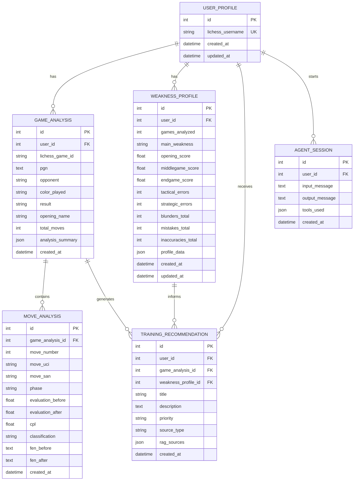

# Database model

Cerno uses two different stores on purpose:

- ChromaDB stores semantic chess theory: Lichess studies, chunks, embeddings, and RAG metadata.
- PostgreSQL stores product data: analyzed users, game analyses, critical moves, weakness profiles, recommendations, and agent sessions.

## ERD

## Design notes

- `user_profiles.lichess_username` is unique because the current product analyzes public Lichess users.
- `game_analyses` stores the PGN and structured summary, but not every move.
- `move_analyses` stores only critical moments: inaccuracies, mistakes, and blunders.
- `weakness_profiles.profile_data` keeps the full aggregated profile as JSONB while exposing key fields as columns.
- `training_recommendations.rag_sources` stores the RAG sources used to generate the plan.
- `agent_sessions.tools_used` is reserved for tracing conversational tool calls.
