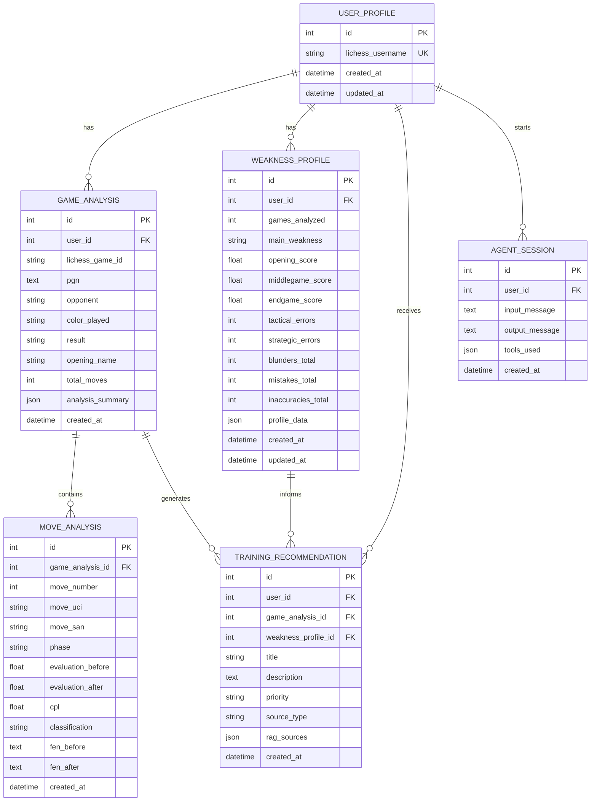

# Database model

Cerno uses two different stores on purpose:

- ChromaDB stores semantic chess theory: Lichess studies, chunks, embeddings, and RAG metadata.
- PostgreSQL stores product data: analyzed users, game analyses, critical moves, weakness profiles, recommendations, and agent sessions.

## ERD

```mermaid
erDiagram
    USER_PROFILE ||--o{ GAME_ANALYSIS : has
    USER_PROFILE ||--o{ WEAKNESS_PROFILE : has
    USER_PROFILE ||--o{ TRAINING_RECOMMENDATION : receives
    USER_PROFILE ||--o{ AGENT_SESSION : starts

    GAME_ANALYSIS ||--o{ MOVE_ANALYSIS : contains
    GAME_ANALYSIS ||--o{ TRAINING_RECOMMENDATION : generates

    WEAKNESS_PROFILE ||--o{ TRAINING_RECOMMENDATION : informs

    USER_PROFILE {
        int id PK
        string lichess_username UK
        datetime created_at
        datetime updated_at
    }

    GAME_ANALYSIS {
        int id PK
        int user_id FK
        string lichess_game_id
        text pgn
        string opponent
        string color_played
        string result
        string opening_name
        int total_moves
        json analysis_summary
        datetime created_at
    }

    MOVE_ANALYSIS {
        int id PK
        int game_analysis_id FK
        int move_number
        string move_uci
        string move_san
        string phase
        float evaluation_before
        float evaluation_after
        float cpl
        string classification
        text fen_before
        text fen_after
        datetime created_at
    }

    WEAKNESS_PROFILE {
        int id PK
        int user_id FK
        int games_analyzed
        string main_weakness
        float opening_score
        float middlegame_score
        float endgame_score
        int tactical_errors
        int strategic_errors
        int blunders_total
        int mistakes_total
        int inaccuracies_total
        json profile_data
        datetime created_at
        datetime updated_at
    }

    TRAINING_RECOMMENDATION {
        int id PK
        int user_id FK
        int game_analysis_id FK
        int weakness_profile_id FK
        string title
        text description
        string priority
        string source_type
        json rag_sources
        datetime created_at
    }

    AGENT_SESSION {
        int id PK
        int user_id FK
        text input_message
        text output_message
        json tools_used
        datetime created_at
    }
```

## Design notes

- `user_profiles.lichess_username` is unique because the current product analyzes public Lichess users.
- `game_analyses` stores the PGN, full-game ply count, and player-specific
  structured phase summary, but not every move.
- `move_analyses` stores only the analyzed user's critical moments:
  inaccuracies, mistakes, and blunders. Ownership is implied by
  `game_analyses.color_played`; no opponent critical move is persisted for that
  user's analysis.
- `weakness_profiles.profile_data` keeps the full aggregated profile as JSONB while exposing key fields as columns.
- `training_recommendations.rag_sources` stores the RAG sources used to generate the plan.
- `agent_sessions.tools_used` is reserved for tracing conversational tool calls.
- Timestamp columns represented as required `datetime` values in the ORM are
  `NOT NULL` in PostgreSQL. Migration `0002_timestamp_columns_not_null`
  defensively fills historical nulls before enforcing that contract.
- Phase 2B verifies the schema by upgrading an empty real PostgreSQL database to
  Alembic `head` and comparing the resulting schema with SQLAlchemy metadata.
