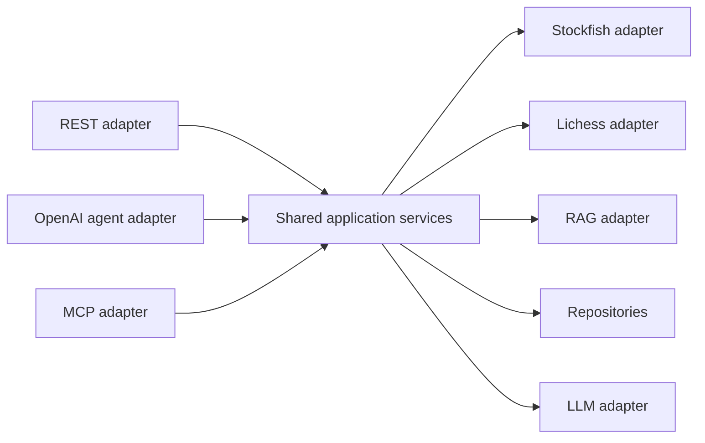

# Cerno MCP integration plan

**Status:** Local `stdio` scope implemented; remote scope not started
**Current capability:** Three typed, read-only MCP tools over local `stdio`
**Last reviewed:** 2026-08-04

## 1. Purpose

MCP will expose stable Cerno capabilities to compatible external hosts. It is an integration interface, not a replacement for the REST API, the frontend, or Cerno's application services.

The implementation must use the official protocol and a supported SDK version selected at implementation time.

## 2. Current state

Cerno currently has:

- REST endpoints;
- shared service functions with varying degrees of coupling;
- a separate OpenAI-specific function-calling agent;
- the official Python MCP SDK pinned at `mcp==1.28.1`;
- a local MCP server with initialization, tool discovery, typed calls, and
  controlled errors;
- official-client tests, including a real `stdio` subprocess smoke test.

Cerno deliberately does not have:

- remote MCP transport;
- HTTP, SSE, or Streamable HTTP MCP;
- MCP authentication or authorization;
- MCP resources or prompts;
- indexing, persistence, profile mutation, or administration tools.

The JSON tool definitions in [`app/services/agent.py`](../app/services/agent.py) are internal OpenAI function calling and must continue to be described that way.

## 3. Product purpose

Approved use case:

```text
External MCP host
  -> discovers Cerno tools
  -> submits PGN or player request
  -> Cerno uses shared application services
  -> host receives structured chess analysis
  -> host decides how to present or reason over it
```

Potential hosts include compatible coding assistants, chat assistants, and IDE integrations. Compatibility with each named host must be verified rather than assumed.

## 4. Preconditions

Phase 6 starts only after:

- Phase 1 player correctness is complete;
- Phase 2 protects core services and contracts;
- Phase 3 defines retrieval evidence and no-answer;
- Phase 4 defines generated-output contracts where generation is involved;
- Phase 5 exposes bounded, typed shared tools.

MCP must not become a second implementation of chess analysis.

## 5. Target layering



The MCP adapter owns:

- protocol schemas;
- tool/resource registration;
- transport;
- MCP error mapping;
- MCP authorization context;
- progress/cancellation mapping.

It does not own:

- Stockfish calculation;
- player projection;
- weakness aggregation;
- retrieval logic;
- persistence logic;
- prompt construction.

## 6. Implemented tools

The first release publishes exactly three tools. All inputs and outputs use
Pydantic-derived JSON Schemas, and all successful calls use a typed
`status/data/error` envelope.

### 6.1 `analyze_pgn`

- Input: PGN up to 100,000 characters, optional `player_color`, and depth 1-10.
- Without a color: neutral full-game metrics with no player attribution.
- With a color: shared player projection, weaknesses, patterns, retrieval, and
  deterministic recommendations.
- Output: compact metrics, three phase summaries, at most ten critical moments,
  four recommendations, and three studies.
- Excluded from output: full move lists, FEN, and generation internals.

### 6.2 `analyze_lichess_player`

- Input: public username and `games_limit` from 1 to 3.
- Delegates to the shared Lichess coach flow with `save=false`, no database
  session, and LLM generation disabled.
- Output uses the same compact player-analysis schema as color-scoped PGN.

### 6.3 `search_chess_theory`

- Input: English query, optional phase/category filters, and at most three
  results.
- Delegates to the calibrated retrieval service without changing the index.
- Output preserves `evidence_found` or `insufficient_evidence`, bounded study
  fragments and source metadata, and marks every passage as untrusted.

## 7. Excluded initial tools

Do not expose:

- `index_study`;
- index reconciliation mutation;
- arbitrary SQL;
- delete/reset operations;
- generic filesystem/network access;
- implicit save;
- unrestricted prompt execution.

RAG indexing is an administrative operation and remains outside the public MCP tool surface.

## 8. Resources

Resources are optional after initial tools are stable.

Candidate URIs:

```text
cerno://players/{username}/weakness-profile
cerno://players/{username}/analyses/{analysis_id}
cerno://theory/studies/{study_id}/chapters/{chapter_id}
```

Resource design requirements:

- stable URI semantics;
- bounded payloads;
- content type;
- authorization checks;
- not-found behavior;
- no leakage of internal-only fields;
- pagination or references for large histories.

The first MCP release may contain tools only.

## 9. MCP prompts

MCP prompts are not required for the first release. If added later, they should guide user-controlled workflows and reuse the versioned prompt assets from Phase 4 rather than duplicate prompt text.

## 10. Transport sequence

### 10.1 Local `stdio`

First implementation:

- server launched as a subprocess;
- protocol messages only on stdout;
- diagnostic logs on stderr;
- credentials from environment when needed;
- bind no network port;
- provide a sample host configuration.

This is the first conformance and product-value milestone.

### 10.2 Streamable HTTP

Second implementation:

- supported single MCP endpoint;
- controlled local/test deployment first;
- explicit lifecycle and stateless/stateful decision;
- Origin validation;
- HTTPS for remote use;
- authentication and authorization;
- per-user/tool quotas;
- request/session limits;
- observability.

Phase boundary:

- Phase 6 may implement and test Streamable HTTP in a controlled environment.
- It must not be described or deployed as production-ready until Phase 7 security and operational acceptance criteria pass.

This resolves the overlap between the master brief's Phase 6 transport work and Phase 7 security work.

## 11. Authorization and safety

### Local server

- use environment-provided credentials;
- document least-privilege setup;
- never print secrets to stdout;
- avoid exposing admin tools.

### Remote server

- use the approved MCP authorization model;
- validate token audience and scopes;
- use HTTPS;
- validate Origin;
- define read versus compute versus mutation scopes;
- authenticate access to persisted profiles;
- enforce per-tool limits;
- reject oversized PGN/messages;
- redact tokens and private content.

Human confirmation should remain possible for expensive or mutating operations. The initial public tool set is intentionally non-mutating.

## 12. Long-running operations

Stockfish and multi-game analysis can be slow.

The MCP adapter must map application support for:

- timeout;
- cancellation;
- progress notification where appropriate;
- partial failure;
- rate limiting;
- bounded result size.

Do not add background jobs solely for MCP. First measure current duration and share the same job/cancellation abstraction with REST if one is needed.

## 13. Error contract

Map application errors into stable MCP results:

- invalid PGN;
- unsupported player identity;
- Lichess user not found;
- Lichess rate limited;
- Stockfish unavailable;
- analysis timeout;
- retrieval insufficient evidence;
- retrieval unavailable;
- profile not found;
- unauthorized/forbidden;
- internal error with safe message.

Do not return raw stack traces, provider bodies, secrets, or internal filesystem paths.

## 14. Client and conformance testing

### 14.1 Automated client tests

Using the official SDK:

1. start server;
2. initialize session;
3. assert declared capabilities;
4. call `tools/list`;
5. snapshot approved names and schemas;
6. call each tool with a deterministic fixture;
7. assert structured content;
8. close cleanly.

### 14.2 Negative tests

- missing required argument;
- wrong enum/type;
- oversized PGN;
- invalid PGN;
- depth outside policy;
- unauthorized profile;
- timeout;
- cancellation;
- Lichess 429;
- missing Chroma/Stockfish;
- unknown tool;
- attempt to discover administrative indexing.

### 14.3 Transport tests

- `stdio` contains no non-protocol stdout;
- process shutdown is clean;
- Streamable HTTP supports initialization and calls;
- invalid Origin rejected;
- authorization failures return the correct status;
- concurrent sessions respect limits.

### 14.4 MCP Inspector or compatible host

Record a manual verification:

- connection parameters;
- protocol/SDK version;
- tools discovered;
- sample calls;
- error call;
- date and environment.

Inspector or compatible-host evidence supplements automated tests.

## 15. Documentation deliverables

- server installation;
- local `stdio` configuration;
- environment variables;
- tool contracts and examples;
- error behavior;
- limits and persistence defaults;
- client example;
- Inspector procedure;
- remote deployment and authorization guide when applicable;
- compatibility matrix for tested hosts.

## 16. Claims policy

Before Phase 6:

> Cerno uses internal OpenAI function calling. It does not yet implement MCP.

After local MCP acceptance:

> Cerno exposes a protocol-compliant local MCP server with discoverable chess-analysis tools over stdio.

After remote Phase 7 acceptance:

> Cerno exposes an authenticated Streamable HTTP MCP service for approved external clients.

Do not claim that the internal agent uses MCP unless its actual call path is deliberately changed and verified.

## 17. Resolved local-scope decisions

- SDK: official Python package pinned at `mcp==1.28.1`.
- Player selector: optional `player_color`; omission is neutral.
- PGN input: at most 100,000 characters.
- Result strategy: compact structured content; no resources and no viewer
  move/FEN payload.
- Language: English-only theory queries and human-readable results.
- Persisted profiles: not exposed.
- Transport: local `stdio` only.

Remote transport placement, authorization, and host compatibility beyond the
documented local client remain later decisions.

## 18. Phase 6 acceptance criteria

Phase 6 is complete when:

- application logic is shared with REST/agent;
- local `stdio` server initializes with the official client;
- approved tools are discoverable and callable;
- administrative indexing is absent;
- analysis defaults to no persistence;
- standalone PGN output makes no unsupported player attribution;
- schemas and structured errors are tested;
- timeout and cancellation behavior is tested;
- official-client and compatible-host verification are documented;
- sample client/configuration exists;
- no Streamable HTTP implementation exists before Phase 7 security gates.

### Implementation evidence

- [`app/mcp_server.py`](../app/mcp_server.py) owns protocol registration,
  bounds, timeouts, compact mapping, and sanitized errors only.
- [`app/schemas/mcp.py`](../app/schemas/mcp.py) owns the typed tool outputs.
- [`tests/test_mcp.py`](../tests/test_mcp.py) uses the official client, starts a
  real `stdio` subprocess for discovery, calls all tools through protocol
  sessions, and covers invalid inputs, dependency failures, timeout,
  cancellation, abstention, and write/generation absence.
- [`mcp-local-server.md`](./mcp-local-server.md) records startup, Codex
  configuration, contracts, examples, and local limitations.
