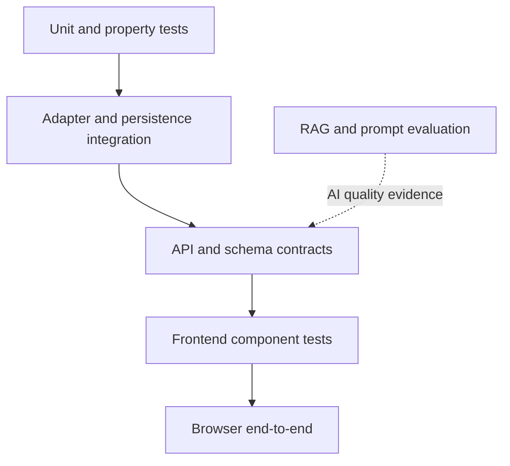

# Cerno testing strategy

**Status:** Approved target strategy
**Implementation phase:** Phase 2, with correctness regressions beginning in Phase 1
**Last reviewed:** 2026-07-28

## 1. Quality objective

Testing exists to constrain behavior and make failures explainable. Test count and raw coverage are supporting signals, not the definition of quality.

The strategy follows four rules:

1. Define the intended contract before freezing behavior.
2. Test critical logic directly rather than mocking it.
3. Use mocks for isolation and real components for integration confidence.
4. Require evidence at the layer where a failure can occur.

## 2. Current state

The committed pre-Phase-1 baseline contained 21 collected backend cases. The
Phase 1 working tree contains 33 collected cases, including parametrized
regressions, and all pass in the latest verified run.

Current strengths:

- fast feedback;
- API-level assertions with FastAPI `TestClient`;
- isolated external boundaries;
- basic config, CORS, health, coach, Lichess, theory, user, and weakness tests;
- Phase 1 player-projection and best-phase regressions;
- a unit-level Stockfish output-contract test for mover ownership;
- no requirement for paid API calls.

Identified limitations:

- no official line or branch coverage;
- no backend lint or type-check quality gate;
- no CI workflow;
- no frontend test framework;
- no automated E2E;
- Stockfish behavior is normally mocked in route tests;
- PostgreSQL repositories are mocked in endpoint tests;
- ChromaDB retrieval is mocked in API tests;
- OpenAI orchestration is largely replaced rather than exercised;
- no mutation testing;
- no contract drift protection.

## 3. Test layers



The evaluation layer is not a replacement for deterministic tests. It measures semantic quality that ordinary assertions cannot cover.

## 4. Unit testing

### 4.1 Stockfish-domain helpers

Directly test:

- `calculate_cpl`;
- `classify_move`;
- exact boundaries at 50/51, 100/101, and 300/301 CPL;
- `get_phase`;
- `get_summary`;
- `detect_phase_weaknesses`;
- score handling around mate values;
- invalid and empty PGN handling.

Tests should assert stable properties rather than exact engine scores where engine versions may vary.

### 4.2 Player projection and weakness aggregation

Phase 1 introduced regression coverage for:

- White user, only Black blunders;
- Black user, only White blunders;
- both players blunder, only the user's error is counted;
- full viewer analysis retains every ply;
- personal critical moments contain only the user's plies;
- persistence receives the player projection rather than the full-game analysis;
- player-only counters and average CPL match the filtered subset;
- empty phases do not become strengths;
- player identity absent from a game produces no personal analysis;
- analysis moves without valid ownership fail closed.

The pure `project_analysis_for_player` helper makes player projection independently
testable. A Docker smoke additionally verifies real Stockfish output for ply count
and ownership. Phase 2 may add property-based coverage without changing this
contract.

### 4.3 Coach

Test:

- happy path with shared services isolated;
- no games;
- game without PGN;
- one game fails and another succeeds;
- all games fail;
- White, Black, win, loss, draw, and anonymous opponent;
- fallback without OpenAI;
- malformed provider output;
- source-reference sanitization;
- `save=false` performs no persistence;
- `save=true` requires a database session;
- commit and rollback orchestration;
- corrected player profile drives RAG queries.

### 4.4 Lichess

Retain current response tests and add:

- empty 200 response;
- malformed NDJSON;
- incomplete player metadata;
- URL-safe usernames;
- local cooldown prevents an additional outbound call;
- concurrent requests remain serialized;
- `Retry-After` remains coherent across router and service.

Live Lichess tests must be opt-in or scheduled because they are rate-limited and externally variable.

### 4.5 RAG technical logic

Unit-test:

- PGN-aware chapter parsing;
- metadata normalization;
- stable chunk IDs;
- content hashes;
- manifest validation;
- source reconciliation;
- deletion plan for stale chunks;
- retrieval-result schema;
- `insufficient_evidence`;
- citation validation;
- query/filter construction.

Semantic quality belongs to the evaluation suite, not only unit tests.

### 4.6 Prompts and structured output

Test:

- prompt registry loads known versions;
- required variables are present;
- dynamic context is serialized separately from instructions;
- Pydantic validation accepts valid output;
- missing, extra, or invalid fields are rejected as designed;
- source IDs must exist in supplied context;
- fallback activates on provider, timeout, and validation failures;
- fallback reason is recorded;
- language selection is respected.

### 4.7 Agent

Test:

- approved tool sequence;
- invalid JSON arguments;
- Pydantic argument rejection;
- unknown tool;
- adapter error;
- maximum iteration boundary;
- timeout;
- cancellation;
- empty model response;
- tool trace without secrets.

## 5. Property-based testing

Use Hypothesis only where general invariants are clearer than enumerated fixtures.

Candidate properties:

- CPL is never negative.
- Error counters are never negative.
- Per-phase move counts sum to the number of projected player moves.
- Total errors cannot exceed player moves.
- Player projection never returns an opponent move.
- Full-game projection preserves input order and count.
- Chunk IDs are stable for the same source/version.
- Manifest reconciliation is idempotent.
- Serialization round trips preserve required fields.
- Valid PGN variations supported by the parser do not crash pure preprocessing.

Property tests must use bounded strategies and produce readable failure examples.

## 6. Stockfish integration

### 6.1 Fixture set

Maintain small controlled PGN fixtures for:

- ordinary opening;
- tactical error;
- mate;
- promotion;
- castling;
- en passant;
- custom initial FEN;
- malformed PGN.

### 6.2 Stable assertions

At low depth, assert:

- expected ply count;
- valid FEN before and after;
- valid mover color;
- non-negative CPL;
- classification belongs to the allowed set;
- move order and SAN/UCI shape;
- structured error when the executable is unavailable.

Avoid relying on exact centipawn scores unless the engine binary and options are pinned and the assertion is intentionally version-specific.

### 6.3 Performance signal

Record analysis duration, depth, and plies for a small benchmark. Start with observation; only introduce a hard budget after a stable baseline exists.

## 7. PostgreSQL integration

Use PostgreSQL, not SQLite as the only substitute, because the schema uses PostgreSQL-specific JSONB and production constraints.

Test workflow:

```text
empty PostgreSQL
  -> alembic upgrade head
  -> create user
  -> save game analysis
  -> replace critical moments
  -> upsert weakness profile
  -> save recommendation
  -> commit
  -> read and verify
```

Required cases:

- migration from empty database;
- unique game-analysis constraint;
- foreign keys;
- JSONB persistence;
- repeat save/upsert;
- stale critical moves removed;
- full coach transaction committed;
- injected failure rolls back every write;
- query ordering and limits.

Integration fixtures must isolate and clean their own data.

## 8. ChromaDB integration

Use a temporary directory and a small deterministic embedding function where semantic model behavior is not under test.

Technical integration cases:

- create collection;
- index known chunks;
- retrieve expected shape;
- preserve metadata;
- empty collection;
- reindex same source;
- source loses a chapter;
- stale chunks removed;
- manifest reconciliation;
- incomplete metadata rejected;
- read/write failure converted to a structured application error.

A separate evaluation run should use the production embedding configuration.

## 9. API contract testing

The backend OpenAPI document and frontend manual types can drift.

Approved options to evaluate in Phase 2:

1. generate TypeScript types/client from OpenAPI; or
2. keep manual client code with a controlled OpenAPI snapshot and contract tests.

Whichever option is chosen must detect:

- removed or renamed fields;
- incompatible enum/type changes;
- request validation changes;
- status-code/error-contract changes.

Contract fixtures should include the additive player-move field introduced by Phase 1 if it is part of the public response.

## 10. Frontend testing

### 10.1 Tooling target

- Vitest;
- React Testing Library;
- MSW;
- `vitest-axe` or equivalent;
- Playwright for browser flows.

Exact versions are selected during implementation and pinned with the existing Next.js version.

### 10.2 Component coverage

#### API client

- base URL normalization;
- network error;
- FastAPI string detail;
- FastAPI validation-array detail;
- unknown non-JSON error;
- success deserialization.

#### Forms and workspace

- Lichess submit;
- PGN submit;
- loading state;
- error state;
- empty state;
- success state;
- switching modes does not mutate unrelated results;
- accessible labels and keyboard submission.

#### Game viewer

- prefers valid engine FEN;
- reconstructs positions from PGN as fallback;
- custom initial FEN;
- invalid FEN fallback;
- previous/next/start/end controls;
- ArrowLeft, ArrowRight, Home, and End;
- move-list synchronization;
- critical-moment jump;
- player orientation;
- manual flip;
- complete ply list;
- responsive size rule at representative viewport sizes.

Tests should target behavior and accessibility roles, not Tailwind class snapshots.

## 11. End-to-end testing

### 11.1 Required PGN scenario

1. Open Cerno.
2. Select PGN analysis.
3. Paste a controlled PGN.
4. Submit.
5. Observe a successful engine report.
6. Navigate moves.
7. Jump to a critical moment.
8. Verify the board changes.

This scenario may use the real local Stockfish service at low depth.

### 11.2 Required Lichess scenario

Use a controlled mock for Lichess at the backend adapter boundary:

1. submit username;
2. return known games;
3. analyze;
4. verify player-specific metrics;
5. review all plies on the board;
6. verify error and rate-limit UI variants.

Live Lichess remains a separate scheduled smoke test.

## 12. Golden regression fixtures

Version fixtures for:

- user with White;
- user with Black;
- opponent-only blunder;
- tactical mistake;
- weak opening;
- weak middlegame;
- weak endgame;
- mate;
- promotion;
- castling;
- en passant;
- initial FEN;
- malformed PGN;
- partial multi-game failure.

Golden assertions may cover stable structured data:

- ply count and mover color;
- phases;
- classification category;
- player-only critical moments;
- profile counters;
- selected retrieval documents;
- prompt structure and source IDs.

Do not compare generative prose word for word unless a deterministic local fallback is specifically under test.

## 13. Coverage policy

Introduce line and branch coverage together.

Policy:

1. record the baseline;
2. prevent regression below the baseline;
3. raise thresholds gradually;
4. apply higher expectations to pure critical logic;
5. review uncovered branches rather than chasing a global vanity number.

Coverage exclusions must be explicit and justified.

## 14. Mutation testing

Begin only after Phase 1 regressions and Phase 2 unit coverage are stable.

First mutation targets:

- classification boundaries;
- CPL clamp;
- player-color filter;
- phase scoring;
- best-phase selection;
- critical-moment selection;
- no-answer threshold logic;
- citation validation.

Mutation testing should initially run manually or on a schedule. It may become a PR gate only after runtime and flakiness are understood.

## 15. Mocking policy

Good uses:

- isolate an HTTP provider while testing application behavior;
- make provider failures deterministic;
- avoid paid calls in PRs;
- test a router's status-code mapping.

Unacceptable substitutions:

- mocking `aggregate_game_analyses` in the only test of aggregation;
- mocking Stockfish in every engine test;
- mocking Chroma in every retrieval pipeline test;
- mocking repositories in every persistence test;
- claiming E2E coverage when the browser or backend is absent.

Every critical adapter requires at least one real automated integration path.

## 16. CI proposal

### Pull request workflow

Run in parallel where safe:

```text
backend-style-and-types
backend-unit-and-coverage
frontend-lint-types-tests-build
contract-check
postgres-integration
chroma-integration
stockfish-smoke
playwright-pgn
```

### Scheduled/manual workflow

```text
rag-evaluation
prompt-evaluation
live-lichess-smoke
optional-live-llm-smoke
mutation-testing
dependency-audit
performance-baseline
```

Paid and externally rate-limited jobs require explicit secrets, budget limits, and opt-in controls.

## 17. Quality gates

A change cannot merge when:

- required deterministic tests fail;
- lint or type checking fails;
- branch coverage drops below the approved threshold;
- OpenAPI contract changes without an approved update;
- migration from empty PostgreSQL fails;
- the relevant integration test fails;
- a critical mutation survives after being designated as a gate;
- the change has undocumented behavior or architecture impact.

RAG and prompt changes additionally require an evaluation comparison and explanation of regressions.

## 18. Phase 2 completion evidence

Phase 2 is complete only with:

- CI run links or equivalent logs;
- coverage reports;
- named integration tests for Stockfish, PostgreSQL, and Chroma;
- frontend test report;
- Playwright PGN evidence;
- contract-check evidence;
- documented remaining gaps and any quarantined flaky test with owner and reason.
